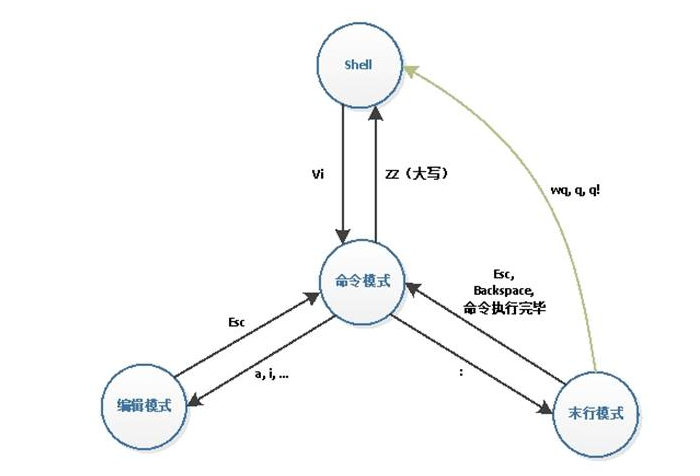

# VIM笔记

## 1. 工作模式

VIM有三种基本工作模式：**命令模式、编辑模式、末行模式**

### 1.1 命令模式

任何时候，只要按下 **ESC**键，即可进入命令模式，在该模式下可以输入各种合法的次命令。

### 1.2 编辑模式

在命令模式下，输入命令 **i（插入），a(附加)，o(打开)， s(替换)**命令，都可进入编辑模式

### 1.3 末行模式

末行模式下，用户可以对文件进行一些附加处理。尽管命令模式下的命令可以完成很多功能，但要执行一些如字符串查找、替换、显示行号等操作还是必须要进入末行模式的。

在命令模式下，输入冒号即可进入末行模式。此时vi窗口的状态行会显示出冒号，等待用户输入命令。用户输入完成后，按回车执行，之后vi编辑器又自动返回到命令模式下。

## 2 vim基本操作
### 2.1 打开文件
**vim filename**: 文件不存在则新建文件并打开，文件存在则打开文件
### 2.2 保存文件

* 进入命令模式， 按下ZZ
* 保存退出

| 键          | 功能                         |
| ----------- | ---------------------------- |
| :wq         | 保存退出                     |
| :x          | 保存退出                     |
| :w filename | 把当前文件保存到 filename    |
| :q          | 退出，如果没保存，则无法退出 |
| :q!         | 强制退出                     |

### 2.3 光标移动

| h      | 左                             |
| ------ | ------------------------------ |
| l      | 右                             |
| k      | 上                             |
| j      | 下                             |
| ^      | 光标移动到行首，第一个有效字符 |
| 0      | 行首                           |
| $      | 行尾                           |
| gg     | 移动到文件第一行               |
| G      | 最后一行                       |
| mG mgg | 到自动行                       |

### 2.4 复制粘贴

| [n]yy | 复制当前行开始的n行          |
| ----- | ---------------------------- |
| p     | 把粘贴板上的内容插入到当前行 |

### 2.5 删除

| [n]x  | 删除光标 后 n个字符                  |
| ----- | ------------------------------------ |
| [n]X  | 删除光标 前 n个字符                  |
| D     | 删除光标位置到行尾的字符             |
| [n]dd | 剪切n行                              |
| dG    | 删除光标到 文件尾部的所有内容        |
| dw    | 删除光标开始位置的字                 |
| d0    | 删除当前光标行的所有内容，不包含光标 |
| dgg   | 删除 文件开始位置-到光标的所有内容   |

### 2.5 撤销

| .      | 执行上一次操作    |
| ------ | ----------------- |
| u      | 撤销前一次操作    |
| ctrl+r | 反撤销            |
| n+.    | 执行上一次操作n次 |

### 2.6 查找

| /string | 从当前光标处 向下查找 |
| ------- | --------------------- |
| ?string | 从当前光标处 向上查找 |

### 2.7 替换

| r    | 替换当前字符     |
| ---- | ---------------- |
| R    | 替换光标后的字符 |

### 2.8 可视模式

| v       | 按字符移动，选中文本       |
| ------- | -------------------------- |
| shift+v | 行选（以行为单位）选中文本 |
| ctrl+v  | 列选 选中文本              |

