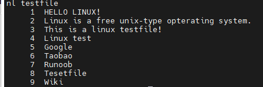
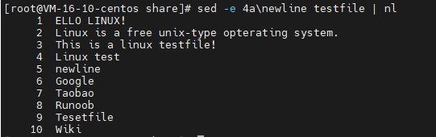
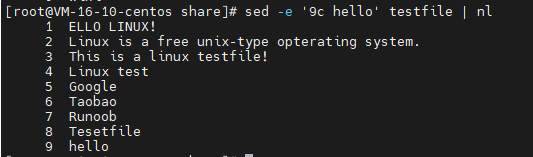
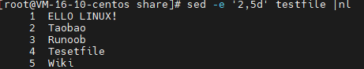
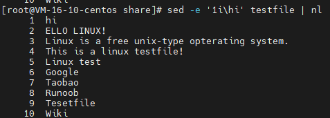
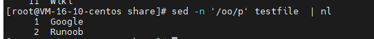
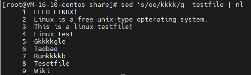
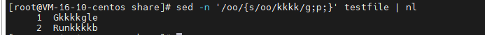

# sed 指令

Linux sed 命令是利用脚本来处理文本文件。

sed 可依照脚本的指令来处理、编辑文本文件。

sed 主要用来自动编辑一个或多个文件、简化对文件的反复操作、编写转换程序等。

```Usage: sed [OPTION]... {script-only-if-no-other-script} [input-file]...```

## 参数

- -e<script>或--expression=<script> 以选项中指定的script来处理输入的文本文件。
- -f<script文件>或--file=<script文件> 以选项中指定的script文件来处理输入的文本文件。
- -h或--help 显示帮助。
- -n或--quiet或--silent 仅显示script处理后的结果。
- -V或--version 显示版本信息
- -i 直接操作源文件

## 动作说明

- a ：新增， a 的后面可以接字串，而这些字串会在新的一行出现(目前的下一行)
- c ：取代， c 的后面可以接字串，这些字串可以取代 n1,n2 之间的行！
- d ：删除，因为是删除啊，所以 d 后面通常不接任何东东；
- i ：插入， i 的后面可以接字串，而这些字串会在新的一行出现(目前的上一行)；
- p ：打印，亦即将某个选择的数据印出。通常 p 会与参数 sed -n 一起运行
- s ：替换

## 示例

测试文件



1. 在第四行后，插入数据

   

   

2. 将第9行数据取代为hello

   

3. 删除2,5行数据

   

4. 在第一行插入数据 "hi"

   

5. 打印包含 'oo' 的字段



6. oo 替换为 kkk

​	



