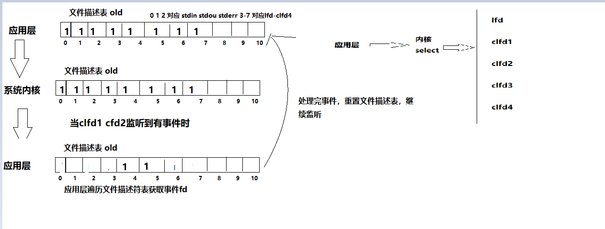

# IO多路复用

## 1. 核心思想

多路IO转接服务器也叫做多任务IO服务器。该类服务器实现的主旨思想是，不再由应用程序自己监视客户端连接，取而代之由内核替应用程序监视文件。

举个栗子：

在一家公司里边，有老板及秘书。秘书监听多个任务，一旦任务有变动，则去提醒老板开始事件。在该例子中秘书就就相当于系统内核，由内核去监听多个事件，事件一旦发生变动，则去通知应用程序开始处理事件。


## 2. Select

### 2.1 原理



### 2.2 注意事项

1. **select**能监听的文件描述符个数受限于**FD_SETSIZE**，一般为1024，单纯改变进程打开的文件描述符个数并不能改变select监听文件个数。

2. 解决1024以下客户端时使用select是很合适的，但如果连接客户端过多，**select采用的是轮询模型**，会大大降低服务器响应效率，不应在select上投入更多精力。

### 2.3 API

**API：**

```c
#include <sys/select.h>
#include <sys/time.h>
#include <sys/types.h>
#include <unistd.h>

int select(int nfds, fd_set *readfds, fd_set *writefds,
           fd_set *exceptfds, struct timeval *timeout);
参数说明：
    nfds：最大文件描述符 + 1
    readfds：需要监听的读的文件描述符存放集合
    writefds：需要监听的写的文件描述符存放集合
    exceptfds：需要监听的异常的文件描述符存放集合
    timeout：多少时间监听一次，填写NULL则永久监听
返回值：
    成功：返回变化文件描述符数量
    失败：返回-1， 设置errno
    
void FD_CLR(int fd, fd_set *set); 在set集合中清楚 fd
int  FD_ISSET(int fd, fd_set *set); fd存在事件
void FD_SET(int fd, fd_set *set); 将fd加入set
void FD_ZERO(fd_set *set); set清零
    
struct timeval {
    long    tv_sec;         /* seconds */
    long    tv_usec;        /* microseconds */
 };
```

### 2.4 demo

```c
#include <stdio.h>
#include <sys/select.h>
#include <sys/time.h>
#include <sys/types.h>
#include <unistd.h>
#include "wrap.h"

int main(int argc, char *argv[])
{
        if (argc != 2)
        {
                fputs("argc != 2", stderr);
                exit(EXIT_FAILURE);
        }

        int fd = tcp4bind(atoi(argv[1]), NULL);

        Listen(fd, 128);

        int maxfd = fd; // 最大文件描述符

        fd_set oldset, rset; // 文件描述符集合
        FD_ZERO(&oldset);
        FD_ZERO(&rset);
        FD_SET(fd, &oldset);

        while(1)
        {
                rset = oldset;

                int n = select(maxfd + 1, &rset, NULL, NULL, NULL);  // 监听文件描述符
                if (n < 0)
                {
                        perror("select");
                        break;
                }
                else if (n == 0)
                {
                        continue; // 没有变化
                }
                else
                {
                        // fd 存在变化 有新的客户端连接
                        if (FD_ISSET(fd, &rset))
                        {
                                struct sockaddr_in addr;
                                socklen_t len = sizeof(addr);
                                char ip[16] = {'0'};

                                int cfd = Accept(fd, (struct sockaddr *)&addr, &len);
                                printf("new client ip=%s port=%d\n",inet_ntop(AF_INET,&addr.sin_addr.s_addr,ip,16),
                                                ntohs(addr.sin_port));
                                // 将cfd加入 oldset
                                FD_SET(cfd, &oldset);

                                if (cfd > maxfd) // 更新最大文件描述符数量
                                {
                                        maxfd = cfd;
                                }

                                if (--n == 0)
                                {
                                        continue;
                                }
                        }

                        // cfd存在变化，则遍历文件描述符
                        int i;
                        char buf[1500];
                        for (i = fd + 1; i <= maxfd; i++)
                        {

                                memset(buf, 0, sizeof(buf));
                                if (FD_ISSET(i, &rset))
                                {
                                        int ret = read(i, buf, sizeof(buf));
                                        if (ret < 0)
                                        {
                                                perror("read");
                                                // 在文件描述符里去掉i
                                                FD_CLR(i, &oldset);
                                                continue;
                                        }
                                        else if (ret == 0)
                                        {
                                                perror("client closed");
                                                FD_CLR(i, &oldset);
                                                continue;
                                        }
                                        else
                                        {
                                                write(STDOUT_FILENO, buf, ret);
                                                write(i, buf, ret);
                                        }
                                }
                        }
                }
        }
        Close(fd);
        return 0;
}


```

## 3. Poll

相对于select没有最大1024文件描述符限制，且请求和返回是分离的（依赖于struct pollfd 结构体）

缺点和select一样:

> 每次都需要将需要监听的文件描述符从应用层拷贝到内核
>
> 每次都需要将数组中的元素遍历一遍才知道那个变化了大量并发
>
> 少量活跃效率低

### 3.1 API

```
#include <poll.h>

int poll(struct pollfd *fds, nfds_t nfds, int timeout);
参数说明：
	fds：监听的数组的首元素地址
	nfds：数组有效元素的最大下标+1
	timeout：超时时间 -1是永久监听 >=0 限时等待

 struct pollfd {
     int   fd;         /* file descriptor */ 
     short events;     /* requested events */
     short revents;    /* returned events */
 };
 events包含：
 	POLLIN：读事件
 	POLLOUT：写事件
 	POLLPRI：异常事件
 	...
 
 返回值：
 	成功：事件数量被返回 非零
 	失败：-1 errno
```

### 3.2 demo

```c
#include <stdio.h>
#include <unistd.h>
#include <stdlib.h>
#include <poll.h>
#include <arpa/inet.h>
#include "wrap.h"

#define MAXLINE 128
#define OPEN_MAX 1024

int main(int argc, char *argv[])
{
        int i, n, maxi, listenfd, connfd, sockfd;
        int nready;                                     /* poll 返回监听个数*/
        struct sockaddr_in cliaddr;
        socklen_t clilen;

        char str[INET_ADDRSTRLEN], buf[MAXLINE];
        struct pollfd client[OPEN_MAX];                 /* poll结构体数组 */

        listenfd = tcp4bind(8080, NULL);
        Listen(listenfd, 128);

        client[0].fd = listenfd;                            /* 要监听的第一个事件*/
        client[0].events = POLLIN;

        for (i = 1; i < OPEN_MAX; i++)
        {
                client[i].fd = -1;                         /* 初始化client集合， -1 代表不监听*/
        }

        maxi = 0;                                         /* client数组有效元素中最大元素下标*/
        for( ; ; )
		 {
                nready = poll(client, maxi + 1, -1);      // 阻塞监听是否有客户端连接请求

                if (client[0].revents & POLLIN)           // listenfd有读事件就绪
                {
                        clilen = sizeof(cliaddr);
                        connfd = Accept(listenfd, (struct sockaddr *)&cliaddr, &clilen);      // 接受客户端请求
                        printf("received from %s at PORT %d\n",
                                        inet_ntop(AF_INET, &cliaddr.sin_addr, str, sizeof(str)),
                                        ntohs(cliaddr.sin_port));

                        for (i = 1; i < OPEN_MAX; i++)
                        {
                                if (client[i].fd < 0)
                                {
                                        client[i].fd = connfd;                // 找到client[]中空闲的位置，存储accept返回值
                                        client[i].events = POLLIN;            // 设置刚才监听的事件为读事件
                                        break;
                                }
                        }

                        if (i == OPEN_MAX)                     // 客户端段连接数超过了最大连接数
                        {
                                perr_exit("too many clients");
                        }


                        if (i > maxi)                         // 更新client数据最大有效值
                        {
                                maxi = i;
                        }

                        if (--nready <= 0)
						{
                                continue;
                        }
                }

                for (i = 1; i <= maxi; i++)
                {
                        if ((sockfd = client[i].fd) < 0)
                        {
                                continue;
                        }

                        if (client[i].revents & POLLIN)
                        {
                                memset(buf, 0, sizeof(buf));
                                if ((n = read(sockfd, buf, MAXLINE)) < 0)
                                {
                                        if (errno == ECONNRESET)
                                        {
                                                // 收到RST标志
                                                printf("client[%d] aborted connection\n", i);
                                                Close(sockfd);
                                                client[i].fd = -1;
                                        }
                                        else
                                        {
                                                perr_exit("read error");
                                        }
                                }
                                else if (n == 0)
                                {
                                        printf("client[%d] closed connection\n", i);
                                        Close(sockfd);
                                        client[i].fd = -1;
								 }
                                else
                                {
                                        write(STDOUT_FILENO, buf, n);
                                        write(sockfd, buf, n);
                                }

                                if (--nready <= 0)
                                {
                                        break;
                                }
                        }
                }
        }
        Close(listenfd);
        return 0;
}
  
```

## 4. Epoll

epoll 多路复用IO接口select/poll的增强版本，它能显著提高程序在大量并发连接中只有少量活跃的情况下的系统CPU利用率。

优点如下：

1. 它会复用文件描述符集合来传递结果而不用迫使开发者每次等待事件之前都必须重新准备要被侦听的文件描述符集合

2. 在获取事件的时候，它无须遍历整个被侦听的描述符集，只要遍历那些被内核IO事件异步唤醒而加入Ready队列的描述符集合就行了。

### 4.1 API

### 4.1.1 epoll_create

```c
#include <sys/epoll.h>

int epoll_create(int size);
功能：创建一个epoll句柄，参数size用来告诉内核监听的文件描述符的个数，跟内存大小有关
参数： 
    size: 监听数目（内核参考值）在linux 2.6.8+，该参数被忽略，大于0即可，监听数目动态增长
返回值：
        成功：文件句柄
        失败：-1 ，设置errono
```

### 4.1.2 epoll_ctl

```c
#include <sys/epoll.h>
int epoll_ctl(int epfd, int op, int fd, struct epoll_event *event)
功能：控制某个epoll监控的文件描述符上的事件：注册、修改、删除。
参数：
    epfd：	为epoll_creat的句柄
    op：		表示动作，用3个宏来表示：
    event：	告诉内核需要监听的事件
op:
	 EPOLL_CTL_ADD (注册新的fd到epfd)，
     EPOLL_CTL_MOD (修改已经注册的fd的监听事件)，
     EPOLL_CTL_DEL (从epfd删除一个fd)；
event:
    EPOLLIN ：	表示对应的文件描述符可以读（包括对端SOCKET正常关闭）
    EPOLLOUT：	表示对应的文件描述符可以写
    EPOLLPRI：	表示对应的文件描述符有紧急的数据可读（这里应该表示有带外数据到来）
    EPOLLERR：	表示对应的文件描述符发生错误
    EPOLLHUP：	表示对应的文件描述符被挂断；
    EPOLLET： 	将EPOLL设为边缘触发(Edge Triggered)模式，这是相对于水平触发而言的
    EPOLLONESHOT：只监听一次事件，当监听完这次事件之后，如果还需要继续监听这个socket的话，需要再次把这个socket加入到EPOLL队列里
        
返回值：
        成功：0
        失败：-1，设置相应的errno
        
struct epoll_event {
    __uint32_t events; /* Epoll events */
    epoll_data_t data; /* User data variable */
};
typedef union epoll_data {
    void *ptr;
    int fd;
    uint32_t u32;
    uint64_t u64;
} epoll_data_t;
```

### 4.1.3 epoll_wait

```c
#include <sys/epoll.h>

等待所监控文件描述符上有事件的产生，类似于select()调用。
int epoll_wait(int epfd, struct epoll_event *events, int maxevents, int timeout)
		events：		用来存内核得到事件的集合，可简单看作数组。
		maxevents：	告之内核这个events有多大，这个maxevents的值不能大于创建epoll_create()时的size，
		timeout：	是超时时间
			-1：	阻塞
			0：	立即返回，非阻塞
			>0：	指定毫秒
		返回值：	成功返回有多少文件描述符就绪，时间到时返回0，出错返回-1
```

### 4.2 事件模型

**EPOLL事件**有两种模型：

* **水平触发**：水平触发只要缓冲区有数据都会触发

  * LT是**缺省**的工作方式，并且同时支持block和no-block socket
  * 在这种做法中，内核告诉你一个文件描述符是否就绪了，然后你可以对这个就绪的fd进行IO操作。如果你不作任何操作，内核还是会继续通知你的
  * **select/poll都是这种模型的代表**

* **边沿触发**：边沿触发只有数据到来才触发，不管缓存区中是否还有数据。

  * 基于**非阻塞文件句柄**
  * 只有当read或者write返回EAGAIN(非阻塞读，暂时无数据)时才需要挂起、等待。但这并不是说每次read时都需要循环读，直到读到产生一个**EAGAIN**才认为此次事件处理完成，当read返回的读到的数据长度小于请求的数据长度时，就可以确定此时缓冲中已没有数据了，也就可以认为此事读事件已处理完成
  * 在这种模式下，当描述符从未就绪变为就绪时，内核通过epoll告诉你。然后它会假设你知道文件描述符已经就绪，并且不会再为那个文件描述符发送更多的就绪通知。请注意，如果一直不对这个fd作IO操作(从而导致它再次变成未就绪)，内核不会发送更多的通知(only once).

  **tips:**

  > epoll 一般将客户端cfd设置为非阻塞， 读事件设置为边沿触发的方式。服务端fd采用默认的水平触发

### 4.3 demo

```c
#include <stdio.h>
#include <unistd.h>
#include <sys/epoll.h>
#include <stdlib.h>
#include <fcntl.h>
#include "wrap.h"

int main()
{
	int fd = tcp4bind(8080, NULL);
	Listen(fd, 128);

	// 创建epoll句柄
	int epfd = epoll_create(1);

	struct epoll_event ev, evs[1024];
	// 将fd添加到epoll红黑树中
	ev.events = EPOLLIN;
	ev.data.fd = fd;
	epoll_ctl(epfd, EPOLL_CTL_ADD, fd, &ev);

	while(1)
	{
		// epoll 监听
		int nready = epoll_wait(epfd, evs, sizeof(evs), -1);
		printf("nready...\n");
		if (nready < 0)
		{
			perror("epoll_wait");
			break;
		}	
		else if (nready == 0)
		{
			continue;
		}
		else 
		{
			for (int i = 0; i < nready; i++)
			{
				if ((evs[i].data.fd == fd) && (evs[i].events & EPOLLIN))
				{
					// fd 
					struct sockaddr_in addr;
					socklen_t len = sizeof(addr);
					char ip[16] = {'0'};
					int cfd = Accept(fd, (struct sockaddr *)&addr, &len);

					printf("client,ip=%s, port=%d\n",
							inet_ntop(AF_INET, &addr.sin_addr.s_addr, ip, 16),
							ntohs(addr.sin_port));	

					// set cfd non-block 
					int flags = fcntl(cfd, F_GETFL);
					flags |= O_NONBLOCK;
					fcntl(cfd, F_SETFL, flags);

					// add cfd to epoll 
					ev.events = EPOLLIN | EPOLLET; // EPOLLET 边沿触发方式
					ev.data.fd = cfd;
					epoll_ctl(epfd, EPOLL_CTL_ADD, cfd, &ev);
				}
				else if (evs[i].events & EPOLLIN)
				{
					while(1)
					{

						char buf[4] = {'0'};
						// 缓冲区如没有数据，
						// 阻塞方式，则read阻塞，
						// 非阻塞方式，read返回值为-1，EAGEIN
						int n = read(evs[i].data.fd, buf, sizeof(buf));
						if (n < 0)
						{
							if (errno == EAGAIN)
							{
								break;
							}
							perror("read");
							Close(evs[i].data.fd);
							epoll_ctl(epfd, EPOLL_CTL_DEL, evs[i].data.fd, &evs[i]);
							break;
						}
						else if (n == 0)
						{
							printf("client closed\n");
							Close(evs[i].data.fd);
							epoll_ctl(epfd, EPOLL_CTL_DEL, evs[i].data.fd, &evs[i]);
							break;
						}
						else 
						{
							write(STDOUT_FILENO, buf, n);
							write(evs[i].data.fd, buf, n);
						}
					}
				}

			}

		}
	}

	close(fd);
	return 0;
}
```

## 5. epoll反应堆

借鉴封装的思想，简单的说就是当某个事情发生了，自动的去处理这个事情。这样的思想对我们的编码来说就是**设置回调，将文件描述符，对应的事件，和事件产生时的处理函数封装**到一起，这样当某个文件描述符的事件发生了，回调函数会自动被触发，这就是所谓的反应堆思想。

```c
typedef union epoll_data {
               void        *ptr;
               int          fd;
               uint32_t     u32;
               uint64_t     u64;
} epoll_data_t;
使用ptr 指向一块内存区域，设置回调
```

```c
#include <stdio.h>
#include <stdlib.h>
#include <string.h>
#include <unistd.h>
#include <arpa/inet.h>
#include <sys/socket.h>
#include <sys/epoll.h>
#include <fcntl.h>
#include "wrap.h"

#define _BUF_LEN_  1024                     // 读写缓冲区
#define _EVENT_SIZE_ 1024                   // 数组最大数量

// 事件驱动结构体
typedef struct _events
{
	int fd;
	int events;
	void *arg;
	void (*callback)(int fd, int events, void *arg);
	char buf[_BUF_LEN_];
	int buflen;
	int epfd;
}xevents;

xevents events_g[_EVENT_SIZE_ + 1];

int epfd_g = 0;  // epoll根节点

int  initsocket();
void initAccept(int fd,int events,void *arg);
void readData(int fd,int events,void *arg);
void sendData(int fd,int events,void *arg);
void eventdel(xevents *ev,int fd,int events);
void eventadd(int fd,int events,void (*callback)(int ,int ,void *),void *arg,xevents *ev);
void eventset(int fd,int events,void (*callback)(int ,int ,void *),void *arg,xevents *ev);

// 初始化套接字 
int initsocket()
{
	// 创建socket 
	int lfd = Socket(AF_INET, SOCK_STREAM, 0); 

	//端口复用
        int opt = 1;
        setsockopt(lfd,SOL_SOCKET,SO_REUSEADDR,&opt,sizeof(opt));

	// bind 
	struct sockaddr_in addr;
	addr.sin_family = AF_INET;
	addr.sin_port = htons(8888);
	addr.sin_addr.s_addr = htonl(INADDR_ANY);
	Bind(lfd, (struct sockaddr *)&addr, sizeof(addr));

	// 监听
	Listen(lfd, 128);
	
	return lfd;
}

void sendData(int fd, int events, void *arg)
{
	printf("begin call %s, fd = %d\n", __FUNCTION__, fd);
	xevents *ev = (xevents *)arg;

	int n = send(fd, ev->buf, ev->buflen, 0);
	if (n <= 0)
	{
		perror("send");
		Close(fd);
		eventdel(ev, fd, events);
		return;
	}
	//events = EPOLLIN | EPOLLET;
	eventset(fd, EPOLLIN, readData, arg, ev);
}

void readData(int fd, int events, void *arg)
{
	printf("begin call %s, fd = %d\n", __FUNCTION__, fd);
	xevents *ev = (xevents *)arg;

	ev->buflen = recv(fd, ev->buf, sizeof(ev->buf), 0);		
	ev->buf[ev->buflen] = '\0';

	if (ev->buflen <= 0)
	{
		perror("recv");
		Close(fd);
		eventdel(ev, fd, events);
		return;
	}
	eventset(fd, EPOLLOUT, sendData, arg, ev);
}

// 新连接处理
void initAccept(int fd, int events, void *arg)
{
	printf("begin call %s, epfd_g = %d, fd = %d\n", __FUNCTION__, epfd_g, fd);

	int i;
	struct sockaddr_in addr;
	socklen_t len = sizeof(addr);

	int cfd = Accept(fd, (struct sockaddr *)&addr, &len); 

	// cfd设置为非阻塞
	//int flags = fcntl(cfd, F_GETFL);
	//flags |= O_NONBLOCK;
	//fcntl(fd, F_SETFL, flags); 

	// 查找events_g数组中可用位置
	for (i = 0; i < _EVENT_SIZE_; i++)
	{
		if (events_g[i].fd == 0)
		{
			break;
		}
	}

	//events |= EPOLLET; // 边沿触发

	// 设置读事件
	eventadd(cfd, events, readData, &events_g[i], &events_g[i]);
}

void eventadd(int fd, int events, void (*callback)(int, int, void *), void *arg, xevents *ev)
{
	ev->fd = fd;
	ev->events = events;
	// ev->arg = arg;
	ev->callback = callback;

	struct epoll_event epv;
	epv.events = events;
	epv.data.ptr = ev;    // 反应堆重点 

	epoll_ctl(epfd_g, EPOLL_CTL_ADD, fd, &epv);
}

//修改事件
//eventset(fd,EPOLLOUT,senddata,arg,ev);
void eventset(int fd,int events,void (*callback)(int ,int ,void *),void *arg,xevents *ev)
{
	ev->fd = fd;
	ev->events = events;
	//ev->arg = arg;
	ev->callback = callback;

	struct epoll_event epv;
	epv.events = events;
	epv.data.ptr = ev;
	epoll_ctl(epfd_g, EPOLL_CTL_MOD, fd, &epv);//修改
}


// 删除事件
void eventdel(xevents *ev, int fd, int events)
{
	printf("begn call %s, fd = %d\n", __FUNCTION__, fd);

	ev->fd = 0;
	ev->events = 0;
	ev->callback = NULL;
	// ev->arg = NULL;
	memset(ev->buf, 0, sizeof(ev->buf));

	struct epoll_event epv;
	epv.data.ptr = NULL;
	epv.events = events;

	epoll_ctl(epfd_g, EPOLL_CTL_DEL, fd, &epv);
}

int main(int argc, char *argv[])
{
	// 初始化socket 
	int lfd = initsocket();

	// 创建epoll根节点 
	epfd_g = epoll_create(1);
	printf("epfd_g = %d\n", epfd_g);

	struct epoll_event events[_EVENT_SIZE_];

	// 添加最初事件，将lfd 上树
	eventadd(lfd, EPOLLIN, initAccept, &events_g[_EVENT_SIZE_], &events_g[_EVENT_SIZE_]); 

	while (1)
	{
		int nready = epoll_wait(epfd_g, events, _EVENT_SIZE_, -1);
		if (nready < 0 )
		{
			perr_exit("epoll_wait failed");
		}
		else if (nready > 0)
		{
			int i = 0;
			for (i = 0; i < nready; i++)
			{
				xevents *xe = events[i].data.ptr;
				//printf("epoll_wait-->listen fd=%d\n", xe->fd);

				if (xe->events & events[i].events)
				{
					xe->callback(xe->fd, xe->events, xe);  // 回调事件 
				}
			
			}
		}
	
	
	}
	// 关闭lfd
	Close(lfd);
	return 0;
}

```

## 6. 线程池

线程池,事先创建几个线程,,不停取任务,如果没有任务休眠,省去了不停的创建线程销毁销毁线程的事件和资源

线程池核心模型为：生产者、消费者模型。

**tips**:

> 处理的任务,所需要处理的时间必须很短，否则和每次创建销毁有啥区别

在实现过程中心需要（简洁版本）：

* 一把互斥锁：用来锁住整个线程池
* 两个条件变量：一个对应生产者，一个对应消费者

```c
#ifndef __TREADPOOLSIMPLE_H__
#define __TREADPOROSIMPLE_H__

#include <stdio.h>
#include <stdlib.h>
#include <string.h>
#include <sys/types.h>
#include <unistd.h>
#include <pthread.h>
#include <sys/epoll.h>
#include "wrap.h"

// 任务结构体
typedef struct _PoolTask
{
    int tasknum;    //模拟任务编号
    void *arg;      //回调函数参数
    void (*task_func)(void *arg);  //任务的回调函数
    int fd;
    int epfd;
    struct epoll_event *evs;

}PoolTask ;

typedef struct _ThreadPool
{
    int max_job_num;             //最大任务个数
    int job_num;                 //实际任务个数
    PoolTask *tasks;             //任务队列数组
    int job_push;                //入队位置
    int job_pop;                 // 出队位置

    int thr_num;                 //线程池内线程个数
    pthread_t *threads;          //线程池内线程数组
    int shutdown;                //是否关闭线程池

    pthread_mutex_t pool_lock;   //线程池的锁

    pthread_cond_t empty_task;   //任务队列为空的条件
    pthread_cond_t not_empty_task; //任务队列不为空的条件

}ThreadPool;

void create_threadpool(int thrnum,int maxtasknum); //创建线程池--thrnum  代表线程个数，maxtasknum 最大任务个数
void destroy_threadpool(ThreadPool *pool); //摧毁线程池
//void addtask(ThreadPool *pool); 
void addtask(ThreadPool *pool,int fd,struct epoll_event *evs); //添加任务到线程池
void taskRun(void *arg);  //任务回调函

#endif
```

```c
#include "threadpoolsimple.h"

//#define num 1000 // 任务编号

ThreadPool *thrPool = NULL;
int num = 0;

void *thrRun(void *arg);

void create_threadpool(int thrnum,int maxtasknum)
{
	printf("begin call %s-----\n", __FUNCTION__);
	thrPool = (ThreadPool*)malloc(sizeof(ThreadPool));
	if (NULL == thrPool)
	{
		perror("malloc");
		return;
	}

	thrPool->thr_num = thrnum; // 线程个数
	thrPool->max_job_num = maxtasknum; // 最大任务个数
	thrPool->job_num = 0; // 实际任务个数
	thrPool->job_push = 0; // 入队位置
	thrPool->job_pop = 0;
	thrPool->shutdown = 0; // 不销毁线程池

	// 任务队列数组
	thrPool->tasks = (PoolTask*)malloc((sizeof(PoolTask)*maxtasknum));
	if (thrPool->tasks == NULL)
	{
		perror("malloc");
		exit(EXIT_FAILURE);
	}

	// 初始化锁
	pthread_mutex_init(&thrPool->pool_lock, NULL);
	// 初始化条件变量
	pthread_cond_init(&thrPool->empty_task, NULL);
	pthread_cond_init(&thrPool->not_empty_task, NULL);

	// 申请线程id空间
	thrPool->threads = (pthread_t *)malloc(sizeof(pthread_t) * thrnum);

	// 线程分离属性
	pthread_attr_t attr;
	pthread_attr_init(&attr);
	pthread_attr_setdetachstate(&attr, PTHREAD_CREATE_DETACHED);

	int i = 0;
	for (i = 0; i < thrnum; i++)
	{
		pthread_create(&thrPool->threads[i], &attr, thrRun, (void*)thrPool);
	}
}


void destroy_threadpool(ThreadPool *pool)
{
	pool->shutdown = 1;
	pthread_cond_broadcast(&pool->not_empty_task);

	pthread_cond_destroy(&pool->not_empty_task);
	pthread_cond_destroy(&pool->empty_task);
	pthread_mutex_destroy(&pool->pool_lock);

	free(pool->tasks);
	free(pool->threads);
	free(pool);
}

// 添加任务
void addtask(ThreadPool *pool,int fd,struct epoll_event *evs)
{
	printf("begin call %s----\n", __FUNCTION__);
	
	pthread_mutex_lock(&pool->pool_lock);

	// 实际任务总数 大于等于 最大任务数 阻塞
	while(pool->job_num >= pool->max_job_num)
	{
		pthread_cond_wait(&pool->empty_task, &pool->pool_lock);
	}

	int pos = (pool->job_push++) % pool->max_job_num;
	printf("add task %d tasknum==%d\n", pos, num);

	pool->tasks[pos].tasknum = num++;
	pool->tasks[pos].fd = fd;
	pool->tasks[pos].evs = evs;
	pool->tasks[pos].task_func = taskRun;
	pool->tasks[pos].arg = (void*)&pool->tasks[pos];
	pool->job_num++;

	pthread_mutex_unlock(&pool->pool_lock);

	// 通知消费者
	pthread_cond_signal(&pool->not_empty_task);
}

void *thrRun(void *arg)
{
	//printf("begin call %s-----\n",__FUNCTION__);
	int taskpos = 0; // 任务位置
	PoolTask *task = (PoolTask *)malloc(sizeof(PoolTask));

	while(1)
	{
		// 获取``任务
		pthread_mutex_lock(&thrPool->pool_lock);

		// 无任务且不需要销毁线程池则等待
		while(thrPool->job_num <= 0 && !thrPool->shutdown)
		{
			pthread_cond_wait(&thrPool->not_empty_task, &thrPool->pool_lock);
		}

		if (thrPool->job_num)
		{
			// 有任务
			taskpos = (thrPool->job_pop++) % thrPool->max_job_num;
			printf("task out %d...tasknum ==%d\n", taskpos, thrPool->tasks[taskpos].tasknum);
			memcpy(task, &thrPool->tasks[taskpos], sizeof(PoolTask)); // 避免任务被修改
			task->arg = task;
			thrPool->job_num--;

			pthread_cond_signal(&thrPool->empty_task);
		}

		if (thrPool->shutdown)
		{
			pthread_mutex_unlock(&thrPool->pool_lock);
			free(task);
			pthread_exit(NULL);
		}

		// 释放锁
		pthread_mutex_unlock(&thrPool->pool_lock);
		task->task_func(task->arg); // 回调函数
	}
}


void taskRun(void *arg)
{
	PoolTask *task = (PoolTask*)arg;
	char buf[1024]= {'0'};
	int n = read(task->fd , buf,sizeof(buf));
	//printf("read %s, %d bytes\n", buf, n);
	if(n == 0 )
	{
		close(task->fd);//关闭cfd
		epoll_ctl(task->epfd,EPOLL_CTL_DEL,task->fd,task->evs); //将cfd下树
		printf("client close\n");
	}
	else if(n> 0)
	{
		printf("%s\n",buf );
		n = write(task->fd, buf, n);
		//printf("write res: %d bytes\n", n);

	}
	printf("taskRun ending....\n");
}

int main()
{
	create_threadpool(3, 100); // 3线程，最大任务数100

	int i = 0;

	//创建套接字,绑定
	int lfd = tcp4bind(8000,NULL);
	
	//监听
	listen(lfd,128);
	
	//创建树
	int epfd = epoll_create(1);
	struct epoll_event ev, evs[1024];
	ev.data.fd = lfd;
	ev.events = EPOLLIN;//监听读事件
	
	//将ev上树
	epoll_ctl(epfd,EPOLL_CTL_ADD,lfd,&ev);

	while(1)
	{
		int nready = epoll_wait(epfd,evs,1024,-1);
		if(nready < 0)
		{
			perr_exit("epoll_wait");
		}
		else if (nready > 0)
		{
			for (i = 0; i < nready; i++)
			{
				if(evs[i].data.fd == lfd && evs[i].events & EPOLLIN)//如果是lfd变化,并且是读事件
				{
					struct sockaddr_in cliaddr;
					char buf_ip[16]="";
					socklen_t len  = sizeof(cliaddr);

					int cfd = Accept(lfd,(struct sockaddr *)&cliaddr,&len);

					printf("client ip=%s port=%d\n",inet_ntop(AF_INET,
								&cliaddr.sin_addr.s_addr,buf_ip,sizeof(buf_ip)),
							ntohs(cliaddr.sin_port));
					ev.data.fd = cfd;//cfd上树
					ev.events = EPOLLIN;//监听读事件

					epoll_ctl(epfd,EPOLL_CTL_ADD,cfd,&ev);//将cfd上树
				}
				else if(evs[i].data.fd != lfd && evs[i].events & EPOLLIN)//普通的读事件
				{
					addtask(thrPool,evs[i].data.fd,&evs[i]);
				}
			
			}
		}
	}
	
	Close(lfd);
	destroy_threadpool(thrPool);
	return 0;
}

```

进阶版：加入管理者线程，动态增加线程及减少线程

头文件：

```c
#ifndef __THREADPOOL_H_
#define __THREADPOOL_H_

typedef struct threadpool_t threadpool_t;

/**
 * @function threadpool_create
 * @descCreates a threadpool_t object.
 * @param thr_num  thread num
 * @param max_thr_num  max thread size
 * @param queue_max_size   size of the queue.
 * @return a newly created thread pool or NULL
 */
threadpool_t *threadpool_create(int min_thr_num, int max_thr_num, int queue_max_size);

/**
 * @function threadpool_add
 * @desc add a new task in the queue of a thread pool
 * @param pool     Thread pool to which add the task.
 * @param function Pointer to the function that will perform the task.
 * @param argument Argument to be passed to the function.
 * @return 0 if all goes well,else -1
 */
int threadpool_add(threadpool_t *pool, void*(*function)(void *arg), void *arg);

/**
 * @function threadpool_destroy
 * @desc Stops and destroys a thread pool.
 * @param pool  Thread pool to destroy.
 * @return 0 if destory success else -1
 */
int threadpool_destroy(threadpool_t *pool);

/**
 * @desc get the thread num
 * @pool pool threadpool
 * @return # of the thread
 */
int threadpool_all_threadnum(threadpool_t *pool);

/**
 * desc get the busy thread num
 * @param pool threadpool
 * return # of the busy thread
 */
int threadpool_busy_threadnum(threadpool_t *pool);

#endif
```

```c
#include <stdlib.h>
#include <pthread.h>
#include <unistd.h>
#include <assert.h>
#include <stdio.h>
#include <string.h>
#include <signal.h>
#include <errno.h>
#include "threadpool.h"

#define DEFAULT_TIME 10                 /*10s检测一次*/
#define MIN_WAIT_TASK_NUM 10            /*如果queue_size > MIN_WAIT_TASK_NUM 添加新的线程到线程池*/ 
#define DEFAULT_THREAD_VARY 10          /*每次创建和销毁线程的个数*/
#define true 1
#define false 0

typedef struct 
{
    void *(*function)(void *);          /* 函数指针，回调函数 */
    void *arg;                          /* 上面函数的参数 */
} threadpool_task_t;                    /* 各子线程任务结构体 */

/* 描述线程池相关信息 */
struct threadpool_t
{
    pthread_mutex_t lock;               /* 用于锁住本结构体 */
    pthread_mutex_t thread_counter;     /* 记录忙状态线程个数de琐 -- busy_thr_num */

    pthread_cond_t queue_not_full;      /* 当任务队列满时，添加任务的线程阻塞，等待此条件变量 */
    pthread_cond_t queue_not_empty;     /* 任务队列里不为空时，通知等待任务的线程 */

    pthread_t *threads;                 /* 存放线程池中每个线程的tid。数组 */
    pthread_t adjust_tid;               /* 存管理线程tid */
    threadpool_task_t *task_queue;      /* 任务队列(数组首地址) */

    int min_thr_num;                    /* 线程池最小线程数 */
    int max_thr_num;                    /* 线程池最大线程数 */
    int live_thr_num;                   /* 当前存活线程个数 */
    int busy_thr_num;                   /* 忙状态线程个数 */
    int wait_exit_thr_num;              /* 要销毁的线程个数 */

    int queue_front;                    /* task_queue队头下标 */
    int queue_rear;                     /* task_queue队尾下标 */
    int queue_size;                     /* task_queue队中实际任务数 */
    int queue_max_size;                 /* task_queue队列可容纳任务数上限 */

    int shutdown;                       /* 标志位，线程池使用状态，true或false */
};

void *threadpool_thread(void *threadpool);

void *adjust_thread(void *threadpool);

int is_thread_alive(pthread_t tid);

int threadpool_free(threadpool_t *pool);


//threadpool_create(3,100,100);
threadpool_t *threadpool_create(int min_thr_num, int max_thr_num, int queue_max_size)
{
	int i;
	threadpool_t *pool = NULL;
	do
	{
		if((pool = (threadpool_t *)malloc(sizeof(threadpool_t))) == NULL)
		{
			printf("malloc threadpool fail");
			break;                                      /*跳出do while*/
		}

		pool->min_thr_num = min_thr_num;
		pool->max_thr_num = max_thr_num;
		pool->busy_thr_num = 0;
		pool->live_thr_num = min_thr_num;               /* 活着的线程数 初值=最小线程数 */
		pool->wait_exit_thr_num = 0;
		pool->queue_size = 0;                           /* 有0个产品 */
		pool->queue_max_size = queue_max_size;
		pool->queue_front = 0;
		pool->queue_rear = 0;
		pool->shutdown = false;                         /* 不关闭线程池 */

		/* 根据最大线程上限数， 给工作线程数组开辟空间, 并清零 */
		pool->threads = (pthread_t *)malloc(sizeof(pthread_t)*max_thr_num);
		if (pool->threads == NULL)
		{
			printf("malloc threads fail");
			break;
		}
		memset(pool->threads, 0, sizeof(pthread_t)*max_thr_num);

		/* 队列开辟空间 */
		pool->task_queue = (threadpool_task_t *)malloc(sizeof(threadpool_task_t)*queue_max_size);
		if (pool->task_queue == NULL)
		{
			printf("malloc task_queue fail\n");
			break;
		}

		/* 初始化互斥琐、条件变量 */
		if (pthread_mutex_init(&(pool->lock), NULL) != 0
				|| pthread_mutex_init(&(pool->thread_counter), NULL) != 0
				|| pthread_cond_init(&(pool->queue_not_empty), NULL) != 0
				|| pthread_cond_init(&(pool->queue_not_full), NULL) != 0)
		{
			printf("init the lock or cond fail\n");
			break;
		}

		//启动工作线程
		pthread_attr_t attr;
		pthread_attr_init(&attr);
		pthread_attr_setdetachstate(&attr, PTHREAD_CREATE_DETACHED);
		for (i = 0; i < min_thr_num; i++)
		{
			pthread_create(&(pool->threads[i]), &attr, threadpool_thread, (void *)pool);/*pool指向当前线程池*/
			printf("start thread 0x%x...\n", (unsigned int)pool->threads[i]);
		}

		//创建管理者线程
		pthread_create(&(pool->adjust_tid), &attr, adjust_thread, (void *)pool);

		return pool;

	} while (0);

	/* 前面代码调用失败时,释放poll存储空间 */
	threadpool_free(pool);

	return NULL;
}


/* 向线程池中 添加一个任务 */
//threadpool_add(thp, process, (void*)&num[i]);   /* 向线程池中添加任务 process: 小写---->大写*/
int threadpool_add(threadpool_t *pool, void*(*function)(void *arg), void *arg)
{
	pthread_mutex_lock(&(pool->lock));

	/* ==为真，队列已经满， 调wait阻塞 */
	while ((pool->queue_size == pool->queue_max_size) && (!pool->shutdown))
	{
		pthread_cond_wait(&(pool->queue_not_full), &(pool->lock));
	}

	if (pool->shutdown)
	{
		pthread_cond_broadcast(&(pool->queue_not_empty));
		pthread_mutex_unlock(&(pool->lock));
		return 0;
	}

	/* 清空 工作线程 调用的回调函数 的参数arg */
	if (pool->task_queue[pool->queue_rear].arg != NULL)
	{
		pool->task_queue[pool->queue_rear].arg = NULL;
	}

	/*添加任务到任务队列里*/
	pool->task_queue[pool->queue_rear].function = function;
	pool->task_queue[pool->queue_rear].arg = arg;
	pool->queue_rear = (pool->queue_rear + 1) % pool->queue_max_size;       /* 队尾指针移动, 模拟环形 */
	pool->queue_size++;

	/*添加完任务后，队列不为空，唤醒线程池中 等待处理任务的线程*/
	pthread_cond_signal(&(pool->queue_not_empty));
	pthread_mutex_unlock(&(pool->lock));

	return 0;
}


/* 线程池中各个工作线程 */
void *threadpool_thread(void *threadpool)
{
	threadpool_t *pool = (threadpool_t *)threadpool;
	threadpool_task_t task;

	while (true)
	{
		/* Lock must be taken to wait on conditional variable */
		/*刚创建出线程，等待任务队列里有任务，否则阻塞等待任务队列里有任务后再唤醒接收任务*/
		pthread_mutex_lock(&(pool->lock));

		/*queue_size == 0 说明没有任务，调 wait 阻塞在条件变量上, 若有任务，跳过该while*/
		while ((pool->queue_size == 0) && (!pool->shutdown))
		{
			printf("thread 0x%x is waiting\n", (unsigned int)pthread_self());
			pthread_cond_wait(&(pool->queue_not_empty), &(pool->lock));//暂停到这

			/*清除指定数目的空闲线程，如果要结束的线程个数大于0，结束线程*/
			if (pool->wait_exit_thr_num > 0)
			{
				pool->wait_exit_thr_num--;

				/*如果线程池里线程个数大于最小值时可以结束当前线程*/
				if (pool->live_thr_num > pool->min_thr_num)
				{
					printf("thread 0x%x is exiting\n", (unsigned int)pthread_self());
					pool->live_thr_num--;
					pthread_mutex_unlock(&(pool->lock));
					//pthread_detach(pthread_self());
					pthread_exit(NULL);
				}
			}
		}

		/*如果指定了true，要关闭线程池里的每个线程，自行退出处理---销毁线程池*/
		if (pool->shutdown)
		{
			pthread_mutex_unlock(&(pool->lock));
			printf("thread 0x%x is exiting\n", (unsigned int)pthread_self());
			//pthread_detach(pthread_self());
			pthread_exit(NULL);     /* 线程自行结束 */
		}

		/*从任务队列里获取任务, 是一个出队操作*/
		task.function = pool->task_queue[pool->queue_front].function;
		task.arg = pool->task_queue[pool->queue_front].arg;

		pool->queue_front = (pool->queue_front + 1) % pool->queue_max_size;       /* 出队，模拟环形队列 */
		pool->queue_size--;

		/*通知可以有新的任务添加进来*/
		pthread_cond_broadcast(&(pool->queue_not_full));

		/*任务取出后，立即将 线程池琐 释放*/
		pthread_mutex_unlock(&(pool->lock));

		/*执行任务*/
		printf("thread 0x%x start working\n", (unsigned int)pthread_self());
		pthread_mutex_lock(&(pool->thread_counter));                            /*忙状态线程数变量琐*/
		pool->busy_thr_num++;                                                   /*忙状态线程数+1*/
		pthread_mutex_unlock(&(pool->thread_counter));

		(*(task.function))(task.arg);                                           /*执行回调函数任务*/
		//task.function(task.arg);                                              /*执行回调函数任务*/

		/*任务结束处理*/
		printf("thread 0x%x end working\n", (unsigned int)pthread_self());
		pthread_mutex_lock(&(pool->thread_counter));
		pool->busy_thr_num--;                                       /*处理掉一个任务，忙状态数线程数-1*/
		pthread_mutex_unlock(&(pool->thread_counter));
	}

}


/* 管理线程 */
void *adjust_thread(void *threadpool)
{
	int i;
	threadpool_t *pool = (threadpool_t *)threadpool;
	while (!pool->shutdown)
	{

		sleep(DEFAULT_TIME);                                    /*定时 对线程池管理*/

		pthread_mutex_lock(&(pool->lock));
		int queue_size = pool->queue_size;                      /* 关注 任务数 */
		int live_thr_num = pool->live_thr_num;                  /* 存活 线程数 */
		pthread_mutex_unlock(&(pool->lock));

		pthread_mutex_lock(&(pool->thread_counter));
		int busy_thr_num = pool->busy_thr_num;                  /* 忙着的线程数 */
		pthread_mutex_unlock(&(pool->thread_counter));

		/* 创建新线程 算法： 任务数大于最小线程池个数, 且存活的线程数少于最大线程个数时 如：30>=10 && 40<100*/
		if (queue_size >= MIN_WAIT_TASK_NUM && live_thr_num < pool->max_thr_num)
		{
			pthread_mutex_lock(&(pool->lock));
			int add = 0;

			/*一次增加 DEFAULT_THREAD 个线程*/
			for (i = 0; i < pool->max_thr_num && add < DEFAULT_THREAD_VARY
					&& pool->live_thr_num < pool->max_thr_num; i++)
			{
				if (pool->threads[i] == 0 || !is_thread_alive(pool->threads[i]))
				{
					pthread_create(&(pool->threads[i]), NULL, threadpool_thread, (void *)pool);
					add++;
					pool->live_thr_num++;
				}
			}

			pthread_mutex_unlock(&(pool->lock));
		}

		/* 销毁多余的空闲线程 算法：忙线程X2 小于 存活的线程数 且 存活的线程数 大于 最小线程数时*/
		if ((busy_thr_num * 2) < live_thr_num  &&  live_thr_num > pool->min_thr_num)
		{
			/* 一次销毁DEFAULT_THREAD个线程, 隨機10個即可 */
			pthread_mutex_lock(&(pool->lock));
			pool->wait_exit_thr_num = DEFAULT_THREAD_VARY;      /* 要销毁的线程数 设置为10 */
			pthread_mutex_unlock(&(pool->lock));

			for (i = 0; i < DEFAULT_THREAD_VARY; i++)
			{
				/* 通知处在空闲状态的线程, 他们会自行终止*/
				pthread_cond_signal(&(pool->queue_not_empty));
			}
		}
	}

	return NULL;
}


int threadpool_destroy(threadpool_t *pool)
{
	int i;
	if (pool == NULL)
	{
		return -1;
	}
	pool->shutdown = true;

	/*先销毁管理线程*/
	//pthread_join(pool->adjust_tid, NULL);

	for (i = 0; i < pool->live_thr_num; i++)
	{
		/*通知所有的空闲线程*/
		pthread_cond_broadcast(&(pool->queue_not_empty));
	}

	/*for (i = 0; i < pool->live_thr_num; i++)
	  {
	  pthread_join(pool->threads[i], NULL);
	  }*/

	threadpool_free(pool);

	return 0;
}

int threadpool_free(threadpool_t *pool)
{
	if (pool == NULL)
	{
		return -1;
	}

	if (pool->task_queue)
	{
		free(pool->task_queue);
	}

	if (pool->threads)
	{
		free(pool->threads);
		pthread_mutex_lock(&(pool->lock));
		pthread_mutex_destroy(&(pool->lock));
		pthread_mutex_lock(&(pool->thread_counter));
		pthread_mutex_destroy(&(pool->thread_counter));
		pthread_cond_destroy(&(pool->queue_not_empty));
		pthread_cond_destroy(&(pool->queue_not_full));
	}

	free(pool);
	pool = NULL;

	return 0;
}


int threadpool_all_threadnum(threadpool_t *pool)
{
	int all_threadnum = -1;

	pthread_mutex_lock(&(pool->lock));
	all_threadnum = pool->live_thr_num;
	pthread_mutex_unlock(&(pool->lock));

	return all_threadnum;
}

int threadpool_busy_threadnum(threadpool_t *pool)
{
	int busy_threadnum = -1;

	pthread_mutex_lock(&(pool->thread_counter));
	busy_threadnum = pool->busy_thr_num;
	pthread_mutex_unlock(&(pool->thread_counter));

	return busy_threadnum;
}

int is_thread_alive(pthread_t tid)
{
	int kill_rc = pthread_kill(tid, 0);     //发0号信号，测试线程是否存活
	if (kill_rc == ESRCH)
	{
		return false;
	}

	return true;
}

/*测试*/

#ifdef TEST
/* 线程池中的线程，模拟处理业务 */
void *process(void *arg)
{
	printf("thread 0x%x working on task %d\n ",(unsigned int)pthread_self(),*(int *)arg);
	sleep(1);
	printf("task %d is end\n", *(int *)arg);

	return NULL;
}

int main(void)
{
	/*threadpool_t *threadpool_create(int min_thr_num, int max_thr_num, int queue_max_size);*/
	threadpool_t *thp = threadpool_create(3,100,100);   /*创建线程池，池里最小3个线程，最大100，队列最大100*/
	printf("pool inited");

	//int *num = (int *)malloc(sizeof(int)*20);
	int num[20], i;
	for (i = 0; i < 20; i++)
	{
		num[i]=i;
		printf("add task %d\n",i);
		threadpool_add(thp, process, (void*)&num[i]);   /* 向线程池中添加任务 */
	}

	sleep(10);                                          /* 等子线程完成任务 */
	threadpool_destroy(thp);

	return 0;
}
#endif

```

