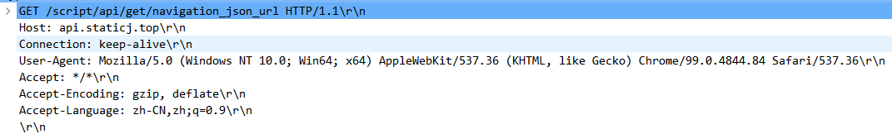
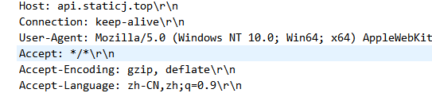

# WebServer实现

## 1. HTTP

### 1.1 请求头



1. **请求行：** GET /Resources HTTP/1.1\r\n

   ​				 请求方式 /路径  http版本 \r\n

2. **请求头：** 

   

3. **请求空行：**

   

### 1.2 响应头


1. **状态行：** HTTP/1.1 200 OK\r\n
2. **消息报头：** Content-Type, Content-length
3. **响应空行：** \r\n


## 2. Epoll实现WebServer

```c
#include <stdio.h>
#include <stdlib.h>
#include <unistd.h>
#include <sys/epoll.h>
#include <fcntl.h>
#include <sys/types.h>
#include <sys/stat.h>
#include <dirent.h>
#include <signal.h>

#include "wrap.h"
#include "pub.h"

#define PORT 8888
#define true 1
#define false 0
#define _EVENT_SIZE 1024

void change_word_dir();
void process_http_request(int epfd, struct epoll_event *evs);
void send_header(int cfd, int code, const char *status, const char *mimeType, int length);
void send_file(int epfd, int cfd, struct epoll_event *ev, const char *path, int flags);

/* 
    epoll 实现web服务器
        1. 获取http请求头信息
        2. 根据请求头信息，请求方式，请求文件等进行响应
        3. 响应具体数据
 */
int main(int argc, char const * argv[])
{
    change_word_dir();
    signal(SIGPIPE, SIG_IGN);
    int lfd;
    int epfd;
    struct epoll_event ev, evs[_EVENT_SIZE];
    int nready;
    int i;

    // 创建socket, bind
    lfd = tcp4bind(PORT, NULL);
    // 监听
    Listen(lfd, 128);

    // 创建epoll根节点
    epfd = epoll_create(1);

    // lfd添加到epoll 
    ev.data.fd = lfd;
    ev.events = EPOLLIN;
    epoll_ctl(epfd, EPOLL_CTL_ADD, lfd, &ev);

    while(true)
    {
        // 循环监听epoll 
        nready = epoll_wait(epfd, evs, _EVENT_SIZE, -1);
        if (nready < 0)
        {
            perror("epoll_wait");
            break;
        }
        else // 监听到了事件 
        {
           for (i = 0; i < nready; i++)
           {
               if (lfd == evs[i].data.fd && evs[i].events & EPOLLIN)
               {
                   struct sockaddr_in sin;
                   socklen_t len = sizeof(sin);
                   char ip[16] = {0};
                   // 提取新连接
                   int cfd  = Accept(evs[i].data.fd, (struct sockaddr *)&sin, &len);
                   printf("client connected: %s:%d\n", inet_ntop(AF_INET, &sin.sin_addr.s_addr, ip, sizeof(ip)), ntohs(sin.sin_port));

                    // 设置为非阻塞
                    int flags = fcntl(cfd, F_GETFL);
                    flags |= O_NONBLOCK;
                    fcntl(cfd, F_SETFL, flags);

                    ev.data.fd = cfd;
                    ev.events = EPOLLIN;
                   // 添加到EPoll
                   epoll_ctl(epfd, EPOLL_CTL_ADD, cfd, &ev);
               }
               else if (evs[i].events & EPOLLIN)
               {
                   process_http_request(epfd, &evs[i]);
               }
           }
        }
    }
    Close(lfd);
    return 0;
}

// 改变当前工作目录
void change_word_dir()
{
    char pwd_path[256] = {0};
    char *buf = getenv("PWD");
    strcpy(pwd_path, buf);
    strcat(pwd_path,"/web-http");
	chdir(pwd_path);
}

// 处理HTTP请求方式
void process_http_request(int epfd, struct epoll_event *evs)
{
    char buf[256] = {0};
    char temp[1024] = {0}; 
    char method[256], content[256], protocol[256];

    int ret = 0;

    // 1. 读取请求行 GET /a.txt  HTTP/1.1\R\N
    ret = recv(evs->data.fd, buf, sizeof(buf), 0);
    if (ret <= 0)
    {
        perror("Closed or Error---->recv");
        Close(evs->data.fd);
        epoll_ctl(epfd, EPOLL_CTL_DEL, evs->data.fd, evs);
        return;
    }
    printf("[%s]\n", buf);

    // 2. 依次丢弃请求头、请求空行
    while(recv(evs->data.fd, temp, sizeof(temp), 0) > 0);

    // 3. 解析请求行
    memset(method, 0, sizeof(method));
    memset(content, 0, sizeof(content));
    memset(protocol, 0, sizeof(protocol));
    ret = sscanf(buf, "%[^ ] %[^ ] %[^ \r\n]", method, content, protocol);
    printf("[%s]  [%s]  [%s]\n", method, content, protocol);
    
    // 4. 请求方式  GET /a.txt  HTTP/1.1\R\N
    if (strcasecmp(method, "get") == 0)
    {
        // a.txt 可能为Unicode编码 解码
        char *str = content + 1;  // content = /a.txt --> str = a.txt 
        strdecode(str, str);

        if (*str == 0)  // 没有请求文件，则选择当前目录
        {
            str = "./";
        }

        // 判断请求文件是否存在
        struct stat s;
        if (stat(str, &s) != 0)
        {
            printf("%s not found\n", str);
            // 发送请求行，请求头，空行
            send_header(evs->data.fd, 404, "Not Found", get_mime_type(".html"), 0);
            // 发送404文件
            send_file(epfd, evs->data.fd, evs, "error.html", 1);
        }
        else 
        {
            // 请求文件是一个目录
            if (S_ISDIR(s.st_mode))
            {
                printf("dir...\n");
                // 发送请求行，请求头，空行
                send_header(evs->data.fd, 200, "OK", get_mime_type("*.html"), 0);

                //发送header.html
				send_file(epfd, evs->data.fd, evs, "dir_header.html", 0);

                // 读取目录
                struct dirent **namelist = NULL;
                int len = 0;
                int n = scandir(str, &namelist, NULL, alphasort);
                char buf[1024] = {0};
                int i = 0;
                for (i = 0; i < n; i++)
                {
                    // 判断每一个文件是否是目录
                    if (namelist[i]->d_type == DT_DIR)
                    {
                        len = sprintf(buf, "<li><a href=%s/ >%s</a></li><br>", namelist[i]->d_name, namelist[i]->d_name);
                    }
                    else 
                    {
                        len = sprintf(buf, "<li><a href=%s >%s</a></li><br>", namelist[i]->d_name, namelist[i]->d_name);
                    }
                    send(evs->data.fd, buf, len, 0);
                    free(namelist[i]);
                }
                free(namelist);

                // 发送尾部
				send_file(epfd, evs->data.fd, evs, "dir_tail.html", 1);

            }
            else if (S_ISREG(s.st_mode))// 请求文件是普通文件
            {
                printf("regular file...\n");
                // 发送请求行，请求头，空行
                send_header(evs->data.fd, 200, "OK", get_mime_type(str), 0);
                // 发送请求文件
                send_file(epfd, evs->data.fd, evs, str, 1);
            }
        }
    }

}

// 发送HTTP响应头：响应行、响应头、响应空行
// 响应行：  HTTP/1.1 200 OK\r\n
// 响应头： Content-type,length
void send_header(int cfd, int code, const char *status, const char *mimeType, int length)
{
    char buf[256] = {0};
    int ret = 0;

    // 发送响应行
    ret = sprintf(buf, "HTTP/1.1 %d %s\r\n", code, status);
    send(cfd, buf, ret, 0);

    // 发送响应头
    ret = sprintf(buf, "Content-Type:%s\r\n", mimeType);
    send(cfd, buf, ret, 0);
    if (length > 0)
    {
        ret = sprintf(buf, "Content-length:%d\r\n", length);
        send(cfd, buf, ret, 0);
    }

    // 发送空行
    send(cfd, "\r\n", 2, 0);
}


// 发送文件
void send_file(int epfd, int cfd, struct epoll_event *ev, const char *path, int flags)
{
    int fd;
    char buf[1024] = {0};
    int ret = 0;

    do
    {
        fd = open(path, O_RDONLY);
        if (fd < 0)
        {
            perror("open...");
            break;
        }

        while(true)
        {
            ret = read(fd, buf, sizeof(buf));
            if (ret <= 0)
            {
                perror("read");
                break;
            }
            printf("send %d bytes\n", send(cfd, buf, ret, 0));
        }
    } while (0);
    
    close(fd);
    if (flags)
    {
        Close(cfd);
        epoll_ctl(epfd, EPOLL_CTL_DEL, cfd, ev);
    }
}
```

## 3.Libevent_bufferevent 实现

```c
#include <stdio.h>
#include <unistd.h>
#include <stdlib.h>
#include <fcntl.h>
#include <string.h>
#include <sys/types.h>
#include <sys/stat.h>
#include <sys/wait.h>
#include <event.h>
#include <event2/listener.h>
#include <dirent.h>
#include "pub.h"

#define _WORK_DIR_ "%s/webpath"
#define _DIR_PREFIX_FILE_ "html/dir_header.html"
#define _DIR_TAIL_FILE_ "html/dir_tail.html"

void listener_cb(struct evconnlistener *evl, evutil_socket_t fd, struct sockaddr *addr, int socklen, void *ptr);
void read_cb(struct bufferevent *bev, void *ctx);
void event_cb(struct bufferevent *bev, short what, void *ctx);
int http_request(struct bufferevent *bev, char *path);
int copy_header(struct bufferevent *bev, int op, char *msg, char *filetype, long filesize);
int copy_file(struct bufferevent *bev, const char *strFile);
int send_dir(struct bufferevent *bev, const char *strPath);

int main()
{
    char workdir[256] = {0};
    struct event_base *base;
    struct sockaddr_in sin;
    struct evconnlistener *listener;

    strcpy(workdir, getenv("PWD"));
    printf("%s\n", workdir);
    chdir(workdir);

    // 创建根节点
    base = event_base_new();

    sin.sin_family = AF_INET;
    sin.sin_port = htons(8888);
    sin.sin_addr.s_addr = htonl(INADDR_ANY);

    // 创建链接侦听器
    listener = evconnlistener_new_bind(base, listener_cb, (void *)base,
                                     LEV_OPT_CLOSE_ON_FREE | LEV_OPT_REUSEABLE, -1,
                                     (struct sockaddr *)&sin, sizeof(sin));

    // 循环监听
    event_base_dispatch(base);

    evconnlistener_free(listener);
    event_base_free(base);
    return 0;
}

// 提取新的链接
void listener_cb(struct evconnlistener *evl, evutil_socket_t fd, struct sockaddr *addr, int socklen, void *ptr)
{
    printf("call %s...\n", __FUNCTION__);
    struct event_base *base = (struct event_base *)ptr;
    struct bufferevent *bev = bufferevent_socket_new(base, fd, BEV_OPT_CLOSE_ON_FREE);
    bufferevent_setcb(bev, read_cb, NULL, event_cb, base);
    bufferevent_enable(bev, EV_READ | EV_WRITE);
}

void read_cb(struct bufferevent *bev, void *ctx)
{
    char buf[256] = {0};
    char method[10], path[256], protocol[10];
    int ret = bufferevent_read(bev, buf, sizeof(buf));
    if (ret > 0)
    {
        sscanf(buf, "%[^ ] %[^ ] %[^ \r\n]", method, path, protocol);
        if (strcasecmp(method, "get") == 0)
        {
            //处理客户端的请求
            char bufline[256];
            write(STDOUT_FILENO, buf, ret);
            //确保数据读完
            while ((ret = bufferevent_read(bev, bufline, sizeof(bufline))) > 0)
            {
                write(STDOUT_FILENO, bufline, ret);
            }
            http_request(bev, path); //处理请求
        }
    }
}

void event_cb(struct bufferevent *bev, short what, void *ctx)
{
    if (what & BEV_EVENT_EOF)
    { //客户端关闭
        printf("client closed\n");
        bufferevent_free(bev);
    }
    else if (what & BEV_EVENT_ERROR)
    {
        printf("err to client closed\n");
        bufferevent_free(bev);
    }
    else if (what & BEV_EVENT_CONNECTED)
    { //连接成功
        printf("client connect ok\n");
    }
}

int http_request(struct bufferevent *bev, char *path)
{
    strdecode(path, path); //将中文问题转码成utf-8格式的字符串
    char *strPath = path;
    if (strcmp(strPath, "/") == 0 || strcmp(strPath, "/.") == 0)
    {
        strPath = "./";
    }
    else
    {
        strPath = path + 1;
    }
    struct stat sb;

    if (stat(strPath, &sb) < 0)
    {
        //不存在 ，给404页面
        copy_header(bev, 404, "NOT FOUND", get_mime_type("error.html"), -1);
        copy_file(bev, "error.html");
        return -1;
    }
    if (S_ISDIR(sb.st_mode))
    {
        //处理目录
        copy_header(bev, 200, "OK", get_mime_type(".html"), sb.st_size);
        send_dir(bev, strPath);
    }
    if (S_ISREG(sb.st_mode))
    {
        //处理文件
        //写头
        copy_header(bev, 200, "OK", get_mime_type(strPath), sb.st_size);
        //写文件内容
        copy_file(bev, strPath);
    }

    return 0;
}

int copy_header(struct bufferevent *bev, int op, char *msg, char *filetype, long filesize)
{
    char buf[4096] = {0};
    sprintf(buf, "HTTP/1.1 %d %s\r\n", op, msg);
    sprintf(buf, "%sContent-Type: %s\r\n", buf, filetype);
    if (filesize >= 0)
    {
        sprintf(buf, "%sContent-Length:%ld\r\n", buf, filesize);
    }
    strcat(buf, "\r\n");
    bufferevent_write(bev, buf, strlen(buf));
    return 0;
}

int copy_file(struct bufferevent *bev, const char *strFile)
{
    int fd = open(strFile, O_RDONLY);
    char buf[1024] = {0};
    int ret;
    while ((ret = read(fd, buf, sizeof(buf))) > 0)
    {
        bufferevent_write(bev, buf, ret);
    }
    close(fd);
    return 0;
}

// 发送目录，实际上组织一个html页面发给客户端，目录的内容作为列表显示
int send_dir(struct bufferevent *bev, const char *strPath)
{
    //需要拼出来一个html页面发送给客户端
    copy_file(bev, _DIR_PREFIX_FILE_);
    // send dir info
    DIR *dir = opendir(strPath);
    if (dir == NULL)
    {
        perror("opendir err");
        return -1;
    }
    char bufline[1024] = {0};
    struct dirent *dent = NULL;
    while ((dent = readdir(dir)))
    {
        struct stat sb;
        stat(dent->d_name, &sb);
        if (dent->d_type == DT_DIR)
        {
            //目录文件 特殊处理
            //格式 <a href="dirname/">dirname</a><p>size</p><p>time</p></br>
            memset(bufline, 0x00, sizeof(bufline));
            sprintf(bufline, "<li><a href='%s/'>%32s</a>   %8ld</li>", dent->d_name, dent->d_name, sb.st_size);
            bufferevent_write(bev, bufline, strlen(bufline));
        }
        else if (dent->d_type == DT_REG)
        {
            //普通文件 直接显示列表即可
            memset(bufline, 0x00, sizeof(bufline));
            sprintf(bufline, "<li><a href='%s'>%32s</a>     %8ld</li>", dent->d_name, dent->d_name, sb.st_size);
            bufferevent_write(bev, bufline, strlen(bufline));
        }
    }
    closedir(dir);
    copy_file(bev, _DIR_TAIL_FILE_);
    // bufferevent_free(bev);
    return 0;
}
```

