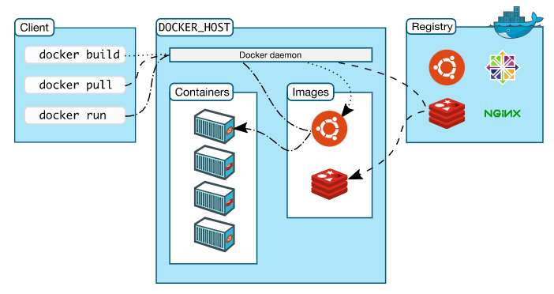

# Docker

## 安装

### 使用官方安装脚本自动安装

```shell
curl -fsSL https://get.docker.com | bash -s docker --mirror Aliyun
```

### Centos7手动安装

```shell
# step 1: 安装必要的一些系统工具
sudo yum install -y yum-utils device-mapper-persistent-data lvm2
# Step 2: 添加软件源信息
sudo yum-config-manager --add-repo http://mirrors.aliyun.com/docker-ce/linux/centos/docker-ce.repo
# Step 3: 更新并安装 Docker-CE
sudo yum makecache fast
# 可指定具体版本 docker-ce-[version]
sudo yum -y install docker-ce
# Step 4: 开启Docker服务
sudo systemctl start docker

注意：其他注意事项在下面的注释中
# 官方软件源默认启用了最新的软件，您可以通过编辑软件源的方式获取各个版本的软件包。例如官方并没有将测试版本的软件源置为可用，你可以通过以下方式开启。同理可以开启各种测试版本等。
# vim /etc/yum.repos.d/docker-ce.repo
#   将 [docker-ce-test] 下方的 enabled=0 修改为 enabled=1
#
# 安装指定版本的Docker-CE:
# Step 1: 查找Docker-CE的版本:
# yum list docker-ce.x86_64 --showduplicates | sort -r
#   Loading mirror speeds from cached hostfile
#   Loaded plugins: branch, fastestmirror, langpacks
#   docker-ce.x86_64            17.03.1.ce-1.el7.centos            docker-ce-stable
#   docker-ce.x86_64            17.03.1.ce-1.el7.centos            @docker-ce-stable
#   docker-ce.x86_64            17.03.0.ce-1.el7.centos            docker-ce-stable
#   Available Packages
# Step2 : 安装指定版本的Docker-CE: (VERSION 例如上面的 17.03.0.ce.1-1.el7.centos)
# sudo yum -y install docker-ce-[VERSION]
# 注意：在某些版本之后，docker-ce安装出现了其他依赖包，如果安装失败的话请关注错误信息。例如 docker-ce 17.03 之后，需要先安装 docker-ce-selinux。
# yum list docker-ce-selinux- --showduplicates | sort -r
# sudo yum -y install docker-ce-selinux-[VERSION]

# 通过经典网络、VPC网络内网安装时，用以下命令替换Step 2中的命令
# 经典网络：
# sudo yum-config-manager --add-repo http://mirrors.aliyuncs.com/docker-ce/linux/centos/docker-ce.repo
# VPC网络：
# sudo yum-config-manager --add-repo http://mirrors.could.aliyuncs.com/docker-ce/linux/centos/docker-ce.repo
```

### yum源设置

```shell
sudo mkdir -p /etc/docker
sudo tee /etc/docker/daemon.json <<-'EOF'
{
  "registry-mirrors": ["https://m2k1pm49.mirror.aliyuncs.com"]
}
EOF
```

## 架构

**Docker** 采用C/S的架构模式，分为client、server端，client端接受用户输入指令，与server端daemon进程进行交互。



### images

images 是一个模板，可用于构建container。类比java中的class-obj

### container

容器是映像的可运行实例，可以使用Docker API或CLI创建、启动、停止、移动或删除容器。类比java中对象

## 指令集合

```shell
docker pull name
docker run -d --name name -p port:port -v path:path -e images
docker exec -it name /bin/bash

docker images 
docker ps -a
# delete image
docker rmi   
# delete container
docker rm 
```

## example

### 安装mysql

```shell
# 拉取images
docker pull mysql

# 运行容器
docker run -d --name mysql8 -p 3306:3306 --restart=always 
-v /usr/local/mysql/data:/var/lib/mysql 
-v /usr/locla/mysql/conf:/etc/mysql/conf.d
-v /usr/local/mysql-files:/var/lib/mysql-files
-v /usr/locla/mysql/my.cnf:/etc/mysql/my.cnf
-e MYSQL_ROOT_PASSWORD=root
mysql:latest

# mysql需要设置 密码模式，及远程登录

version: "3.8"

services:
  mysql8:
    image: mysql:latest
    ports:
      - "3306:3306"
    command: [
        "--character-set-server=utf8mb4",
        "--collation-server=utf8mb4_unicode_ci",
        "--sql_mode=STRICT_TRANS_TABLES,NO_ZERO_DATE,ERROR_FOR_DIVISION_BY_ZERO,NO_ENGINE_SUBSTITUTION"
    ]  
    volumes:
      - type: bind
        source: /mysql/data
        target: /var/lib/mysql
    environment:
      MYSQL_ROOT_PASSWORD: root
      MYSQL_DATABASE: test
volumes:
  mysql8:
```


# Docker Compose

## 安装

```shell
curl -L https://get.daocloud.io/docker/compose/releases/download/1.29.2/docker-compose-`uname -s`-`uname -m` > /usr/local/bin/docker-compose && \
chmod +x /usr/local/bin/docker-compose

# 补全插件
curl -L https://raw.githubusercontent.com/docker/compose/1.29.2/contrib/completion/bash/docker-compose > /etc/bash_completion.d/docker-compose
```

## example

```docker
# 指定版本
version: "3.7"
# 服务集合
services:
  # 名称任意，网络别名
  app:
    image: node:12-alpine
    command: sh -c "yarn install && yarn run dev"
    ports:
      - 3000:3000
    working_dir: /app
    # 数据卷
    volumes:
      - ./:/app
    # 环境变量
    environment:
      MYSQL_HOST: mysql
      MYSQL_USER: root
      MYSQL_PASSWORD: secret
      MYSQL_DB: todos

  mysql:
    image: mysql:5.7
    volumes:
      - todo-mysql-data:/var/lib/mysql
    environment:
      MYSQL_ROOT_PASSWORD: secret
      MYSQL_DATABASE: todos
# 数据卷映射，不会自动创建
volumes:
  todo-mysql-data:
```


