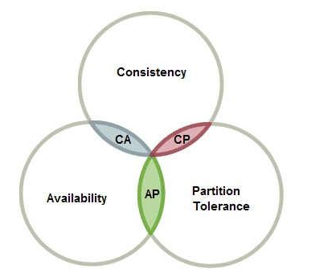

# 分布式设计

## CAP理论

CAP原则又称CAP定理，指的是在一个分布式系统中， Consistency（一致性）、 Availability（可 用性）、Partition tolerance（分区容错性），三者不可得兼。

而CAP理论说的就是：一个分布式系统，不可能同时做到这三点。如下图：



分布式系统的CAP理论：理论首先把分布式系统中的三个特性进行了如下归纳： 

* 一致性（C）：在分布式系统中的所有数据备份，在同一时刻是否同样的值。（等同于所有节点访 问同一份最新的数据副本） 

* 可用性（A）：在集群中一部分节点故障后，集群整体是否还能响应客户端的读写请求。（对数据 更新具备高可用性） 

* 分区容忍性（P）：由于分布式系统通过网络进行通信，网络是不可靠的。当任意数量的消息丢失或延迟到达时，系统仍会继续提供服务，不会挂掉。换句话说，分区容忍性是站在分布式系统的角度，对访问本系统的客户端的再一种承诺：我会一直运行，不管我的内部出现何种数据同步问题，强调的是不挂掉。

对于一个分布式系统而言，P是前提，必须保证，因为只要有网络交互就一定会有延迟和数据丢失，这种状况我们必须接受，必须保证系统不能挂掉。所以只剩下C、A可以选择。要么保证数据一致性（保证数据绝对正确），要么保证可用性（保证系统不出错）。

当选择了C（一致性）时，如果由于网络分区而无法保证特定信息是最新的，则系统将返回错误或超时。

当选择了A（可用性）时，系统将始终处理客户端的查询并尝试返回最新的可用的信息版本，即使由于网络分区而无法保证其是最新的。

## Base理论

BASE是Basically Available（基本可用）、Soft state（软状态）和Eventually consistent（最终一致 性）三个短语的简写，**BASE是对CAP中一致性和可用性权衡的结果**，其来源于对大规模互联网系统分布 式实践的结论，是基于CAP定理逐步演化而来的，**其核心思想是即使无法做到强一致性（Strong consistency），但每个应用都可以根据自身的业务特点，采用适当的方式来使系统达到最终一致性** （Eventual consistency）。

**BA：Basically Available，基本可用**

系统出现了不可预知的故障，但还是能用，相比较正常的系统而言会有响应时间上的损失和功能上的损失。

**Soft state（软状态）**

允许系统中的数据存在中间状态，并认为该状态不影响系统的整体可用性，即允许系统在多个不同节点的数据副本存在数据延时。

**Eventually consistent（最终一致 性）**

最终一致性的本质是需要系统保证**最终数据能够达到一致**，而不需要实时保证系统数据的强 一致性


## 分布式事务解决方案

### 两阶段提交协议（2PC）

核心原理：是通过提交分阶段和记日志的方式，记录下事务提交所处的阶段状态，在组件宕机重启 后，可通过日志恢复事务提交的阶段状态，并在这个状态节点重试，如Coordinator重启后，通过日志 可以确定提交处于Prepare还是PrepareAll状态，若是前者，说明有节点可能没有Prepare成功，或所有 节点Prepare成功但还没有下发Commit，状态恢复后给所有节点下发RollBack；若是PrepareAll状态， 需要给所有节点下发Commit，数据库节点需要保证Commit幂等。

### 事件队列方案

核心思想：是将需要分布式处理的任务通过消息或者日志 的方式来异步执行，消息或日志可以存到本地文件、数据库或消息队列，再通过业务规则进行失败重 试，它要求各服务的接口是幂等的。

### TCC （Try-Confirm-Cancel）补偿模式

核心思想：try阶段为业务预留资源，confirm阶段执行业务（try成功，则confirm一定成功），否则执行cancel进行补偿（释放try阶段预留的资源等）；

### 缓存

缓存（Redis 或者Memcached）通常被用在数据库前面，作为数据读取的缓冲， 使得I/O 操作不至于直接落在数据库上。以商品详情页为例，假如卖家修改了商品信息，并写回到数据 库，但是这时候用户从商品详情页看到的信息还是从缓存中拿到的过时数据，这就出现了缓存系统和数 据库系统中的数据不一致的现象。 

要解决该场景下缓存和数据库数据不一致的问题我们有以下两种解决方案： 

1. 为缓存数据设置过期时间。当缓存中数据过期后，业务系统会从数据库中获取数据，并将新值放入缓存。这个过期时间就是系统可以达到最终一致的容忍时间。 
2. 更新数据库数据后同时清除缓存数据。数据库数据更新后，同步删除缓存中数据，使得下次对商品 详情的获取直接从数据库中获取，并同步到缓存。


## 分布式锁实现方式

### 1. 使用Redis实现分布式锁

#### 1.1 WATCH, MULTI, EXEC, DISCARD事务机制实现分布式锁

```redis
multi
dosomething
exec
```

以上被MULTI和EXEC包裹的redis命令，保证所有事务内的命令将会串行顺序执行，保证不会在事务的执 行过程中被其他客户端打断。 而WATCH命令能够监视某个键，当事务执行时，如果被监视的键被其他客户端修改了值，事务运行失 败，返回相应错误（被事务运行客户端在事务内修改了值，不会造成事务运行失败

#### 1.2 setnx实现分布式锁

SETNX：当指定键不存在时，向Redis中添加一个键值对。Redis客户端保证对统一键名称，多个客户端 同时设置其值时，只有一个客户端能够设置成功的原子性。

### 2.使用ZK

