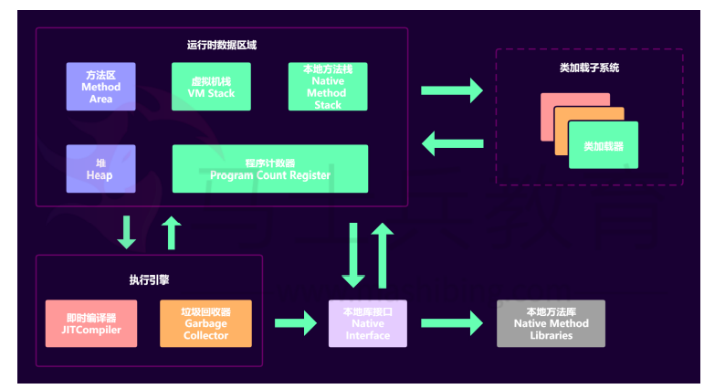
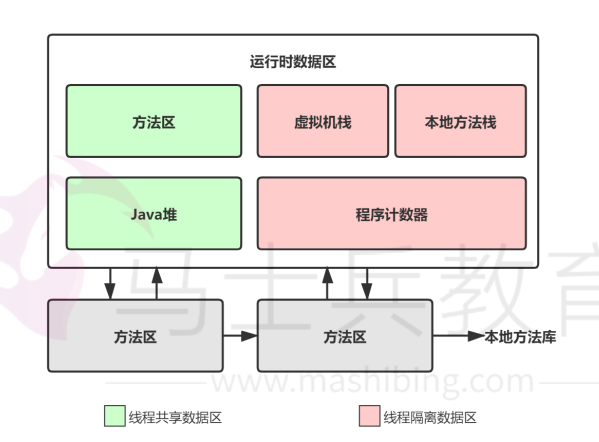
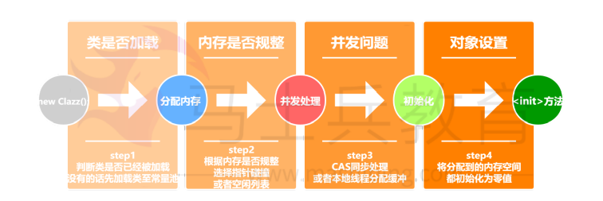
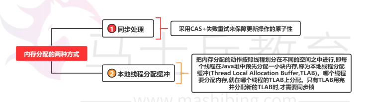
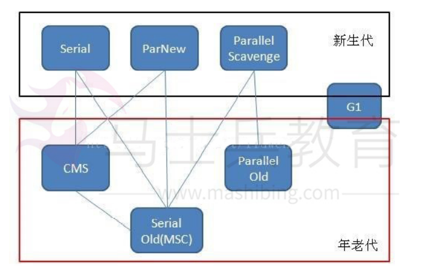
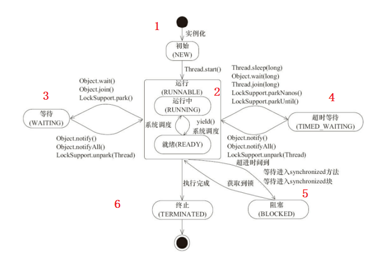
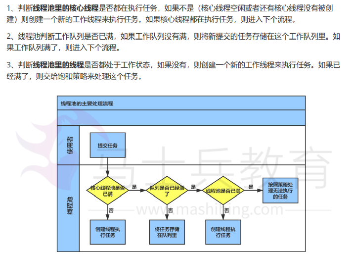
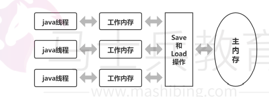
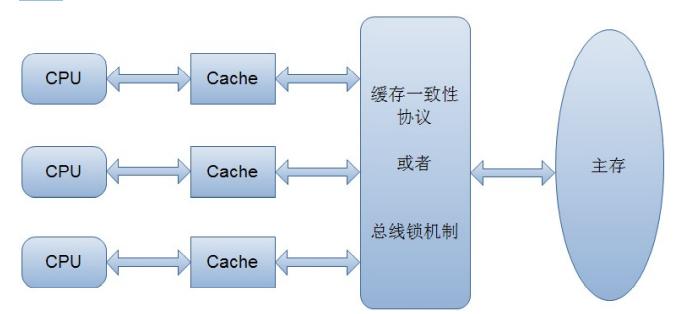
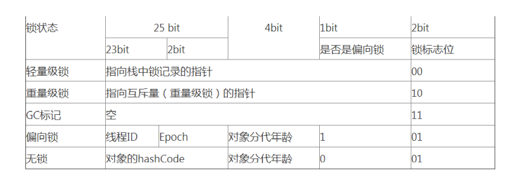

# REVIEW

## 1. Java基础

### 1.1 IO

按照流的流向分，可以分为**输入流和输出流**； 按照操作单元划分，可以划分为**字节流和字符流**； 按照流 的角色划分为**节点流和处理流**。 

* InputStream/Reader: 所有的输入流的基类，前者是字节输入流，后者是字符 输入流。
* OutputStream/Writer: 所有输出流的基类，前者是字节输出流，后者是字符输 出流。

#### 1.1.1 BIO NIO AIO

* BIO：Block IO 同步阻塞式 IO，就是我们平常使用的传统 IO，它的特点是模式简单使用方便，并发处理能力低。 **数据的读取写入必须阻塞在一个线程内等待其完成**
* NIO：Non IO 同步非阻塞 IO，是传统 IO 的升级，客户端和服务器端通过 Channel（通道）通讯，实现了多路复用。**提供了 Channel , Selector，Buffer等抽象**
* AIO：Asynchronous IO 是 NIO 的升级，也叫 NIO2，实现了异步非堵塞 IO，异步 IO 是基于事件和回调机制实现的，也就是应用操作之后会直接返回，不会堵 塞在那里，当后台处理完成，操作系统会通知相应的线程进行后续的操作

#### 1.1.2 IO多路复用

* Select
* Poll
* Epoll

### 1.2 反射

JAVA反射机制是在运行状态中，对于任意一个类，都能够知道这个类的所有属性和方法；对于任意一个 对象，都能够调用它的任意一个方法和属性；这种动态获取的信息以及动态调用对象的方法的功能称为 java语言的反射机制。 

静态编译和动态编译 ：

* 静态编译：在编译时确定类型，绑定对象 
* 动态编译：运行时确定类型，绑定对象 

反射机制优缺点 

* 优点： 运行期类型的判断，动态加载类，提高代码灵活度。

* 缺点： 性能瓶颈：反射相当于一系列解释操作，通知 JVM 要做的事情，性能 比直接的java代码要慢很多。

### 1.3 集合

Map接口和Collection接口是所有集合框架的父接口： 

1. Collection接口的子接口包括：Set接口和List接口 
2. Map接口的实现类主要有：HashMap、TreeMap、Hashtable、 ConcurrentHashMap以及 Properties等 
3. Set接口的实现类主要有：HashSet、TreeSet、LinkedHashSet 等 
4. List接口的实现类主要有：ArrayList、LinkedList、Stack以及Vector等

#### 1.3.1 List、Set、Map

* List：一个有序（元素存入集合的顺序和取出的顺序一致）容器，元素可以重 复，可以插入多个 null元素，元素都有索引。
  * ArrayList：Object数组，支持随机访问，查询快，增删慢
  * LinkedList：双向循环链表，增删快，查询慢
  * Vector：Object数组，支持随机访问，查询快，增删慢， **线程安全**（每个方法上都加了Synchronized）
* Set：一个无序（存入和取出顺序有可能不一致）容器，不可以存储重复元素， 只允许存入一个 null元素，必须保证元素唯一性。Set 接口常用实现类是 HashSet、 LinkedHashSet 以及 TreeSet
  * HashSet（无序，唯一）：基于 HashMap 实现的，底层采用 HashMap 来保存元素
  * LinkedHashSet：  LinkedHashSet 继承与 HashSet，并且其内部是通过 LinkedHashMap 来实现的。
  * TreeSet（有序，唯一）： 红黑树(自平衡的排序二叉树。) 
* Map：Map是一个键值对集合，存储键、值和之间的映射。 Key无序，唯一；value 不 要求有序，允许重复
  * HashMap：数组+链表（红黑树）
  * TreeMap： 红黑树（自平衡的排序二叉树）
  * HashTable：数组+链表组成的，数组是 HashMap 的主体，链表则是主要为 了解决哈希冲突而存在的
  * LinkedHashMap：  继承自 HashMap，所以它的底层仍然是 基于拉链式散列结构即由数组和链表或红黑树组成。另外，LinkedHashMap 在上面 结构的基础上，增加了一条双向链表，使得上面的结构可以保持键值对的插入顺序。 同时通过对链表进行相应的操作，实现了访问顺序相关逻辑。
  * ConcurrentHashMap：

#### 1.3.2 快速失败机制 “fail-fast”？

当多个线程对集合进行结构上的改变的操作 时，有可能会产生 fail-fast 机制。

例如：假设存在两个线程（线程1、线程2），线程1通过Iterator在遍历集合A中 的元素，在某个时候线 程2修改了集合A的结构（是结构上面的修改，而不是简 单的修改集合元素的内容），那么这个时候程序 就会抛出ConcurrentModificationException 异常，从而产生fail-fast机制。 

原因：迭代器在遍历时直接访问集合中的内容，并且在遍历过程中使用一个 modCount 变量。集合在 被遍历期间如果内容发生变化，就会改变modCount 的值。每当迭代器使用hashNext()/next()遍历下一 个元素之前，都会检测 modCount变量是否为expectedmodCount值，是的话就返回遍历；否则抛出 异常，终止遍历。 

解决办法： 

1. 在遍历过程中，所有涉及到改变modCount值得地方全部加上 synchronized。 
2. 使用CopyOnWriteArrayList来替换ArrayList

#### 1.3.3 BlockingQueue是什么？

 Java.util.concurrent.BlockingQueue是一个队列，在进行检索或移除一个元素的时候，它会等待队列变 为非空；当在添加一个元素时，它会等待队列中的可用空间。

BlockingQueue接口是Java集合框架的一 部分，主要用于实现生产者-消费者模式。我们不需要担心等待生产者有可用的空间，或消费者有可用的 对象，因为它都在BlockingQueue的实现类中被处理了。

Java提供了集中 BlockingQueue的实现，比如 ArrayBlockingQueue、LinkedBlockingQueue、PriorityBlockingQueue,、SynchronousQueue等。

在 Queue 中 poll()和 remove()有什么区别？ 

* 相同点：都是返回第一个元素，并在队列中删除返回的对象。 
* 不同点：如果没有元素 poll()会返回 null，而 remove()会直接抛出 NoSuchElementException 异常。

#### 1.3.4 HashMap原理

 HashMap是基于哈希表的Map接口的非同步实现。

数据结构：Node类型数组+链表（红黑树），当链表长度超过8时，链表会转换为红黑树。

HashMap 基于 Hash 算法实现的：

1. 当我们往Hashmap中put元素时，利用key的hashCode重新hash计算出当前对象的元素在数组中 的下标 

2.  存储时，如果出现hash值相同的key，此时有两种情况。

   (1)如果key相 同，则覆盖原始值；

   (2)如果key不同（出现冲突），则将当前的key-value 放入链表中 

3. 获取时，直接找到hash值对应的下标，在进一步判断key是否相同，从而找到对应值。 
4. 核心就是使用了数组的存储方式，然后将冲突的key的对象放入链表中，一旦发现冲突就在链表中做进一步的对比。 


**Hash方法：**

```java
static final int hash(Object key) {
    int h;
    return (key == null) ? 0 : (h = key.hashCode()) ^ (h >>> 16);
}
```

让key.hashCode()与key.hashCode()>>>16进行异或操作，高16bit不变，低16bit和高16bit做了一个异或，目的是减少碰撞。按照函数注释，因为bucket数组大小是2的幂，计算下标index = (table.length - 1) & hash，如果不做 hash 处理，相当于散列生效的只有几个低 bit 位，为了减少散列的碰撞，设计者综合考虑了速度、作用、质量之后，使用高16bit和低16bit异或来简单处理减少碰撞。


**PutVal方法：**

```java
final V putVal(int hash, K key, V value, boolean onlyIfAbsent,
               boolean evict) {
    Node<K,V>[] tab; Node<K,V> p; int n, i;
    // 1. tab为空就扩容
    if ((tab = table) == null || (n = tab.length) == 0)
        n = (tab = resize()).length;
    // 2. 如果key的hash结果对应的tab位置为空，则直接插入table数组
    if ((p = tab[i = (n - 1) & hash]) == null)
        tab[i] = newNode(hash, key, value, null);
    else { // 3. table[i]不为空
        Node<K,V> e; K k;
        if (p.hash == hash &&
            ((k = p.key) == key || (key != null && key.equals(k))))
            e = p; // 4. table[i], key相同，直接覆盖，返回旧值
        else if (p instanceof TreeNode)  // 5. 如果当前key是红黑树节点，则直接在红黑树中插入
            e = ((TreeNode<K,V>)p).putTreeVal(this, tab, hash, key, value);
        else { // 6. 当前key节点存在于链表中
            for (int binCount = 0; ; ++binCount) {
                if ((e = p.next) == null) {
                    p.next = newNode(hash, key, value, null); // 在链表中插入
                    if (binCount >= TREEIFY_THRESHOLD - 1) // -1 for 1st
                        treeifyBin(tab, hash); // 链表长度大于8，转换为红黑树
                    break;
                }
                // 判断链表中结点的key值与插入的元素的key值是否相等
                if (e.hash == hash &&
                    ((k = e.key) == key || (key != null && key.equals(k))))
                    break;
                p = e;
            }
        }
// 判断当前的key已经存在的情况下，再来一个相同的hash值、key值时，返回新来的value这个值
        if (e != null) { // existing mapping for key
            V oldValue = e.value;
            if (!onlyIfAbsent || oldValue == null)
                e.value = value;
            afterNodeAccess(e);
            return oldValue;
        }
    }
    ++modCount;
    // 超过最大容量就扩容
    if (++size > threshold)
        resize();
    afterNodeInsertion(evict);
    return null;
}
```

**ReSize方法：**

1. 在jdk1.8中，resize方法是在hashmap中的键值对大于阀值时或者初始化时，就调用resize方法进行 扩容；
2. 每次扩展的时候，都是扩展2倍； 
3. 扩展后Node对象的位置要么在原位置，要么移动到原偏移量两倍的位置。在putVal()中，我们看到在 这个函数里面使用到了2次resize()方法，resize()方法表示的在进行第一次初始化时会对其进行扩容，或 者当该数组的实际大小大于其临界值值(第一次为12),这个时候在扩容的同时也会伴随的桶上面的元素进 行重新分发，则是根据在同一个桶的位置中进行判断(e.hash & oldCap)是 否为0，重新进行hash分配后，该元素的位置要么停留在原始位置，要么移动到原始位置+增加的数组大小这个位置上。

```java
final Node<K,V>[] resize() {
    Node<K,V>[] oldTab = table;
    int oldCap = (oldTab == null) ? 0 : oldTab.length;
    int oldThr = threshold;
    int newCap, newThr = 0;
    // 如果oldCap不为空的话，就是hash桶数组不为空
    if (oldCap > 0) { 
        // 如果大于最大容量了，就赋值为整数最大的阀
        if (oldCap >= MAXIMUM_CAPACITY) {
            threshold = Integer.MAX_VALUE;
            return oldTab;
        }
        // 如果当前hash桶数组的长度在扩容后仍然小于最大容量 并且oldCap大于默认值16
        else if ((newCap = oldCap << 1) < MAXIMUM_CAPACITY &&
                 oldCap >= DEFAULT_INITIAL_CAPACITY)
            newThr = oldThr << 1; // 容量加倍
    }
    else if (oldThr > 0) 
        newCap = oldThr;
    else {               
        newCap = DEFAULT_INITIAL_CAPACITY;
        newThr = (int)(DEFAULT_LOAD_FACTOR * DEFAULT_INITIAL_CAPACITY); // 12 阈值
    }
    
    if (newThr == 0) {
        float ft = (float)newCap * loadFactor;
        newThr = (newCap < MAXIMUM_CAPACITY && ft < (float)MAXIMUM_CAPACITY ?
                  (int)ft : Integer.MAX_VALUE);
    }
    threshold = newThr;

    Node<K,V>[] newTab = (Node<K,V>[])new Node[newCap];
    table = newTab;
    if (oldTab != null) {
        for (int j = 0; j < oldCap; ++j) {
            Node<K,V> e;
            if ((e = oldTab[j]) != null) {
                oldTab[j] = null;
                // 插入Node数组
                if (e.next == null)
                    newTab[e.hash & (newCap - 1)] = e;
                // 插入红黑树
                else if (e instanceof TreeNode)
                    ((TreeNode<K,V>)e).split(this, newTab, j, oldCap);
                else { // preserve order 插入链表
                    Node<K,V> loHead = null, loTail = null;
                    Node<K,V> hiHead = null, hiTail = null;
                    Node<K,V> next;
                    do {
                        next = e.next;
                        if ((e.hash & oldCap) == 0) {
                            if (loTail == null)
                                loHead = e;
                            else
                                loTail.next = e;
                            loTail = e;
                        }
                        else {
                            if (hiTail == null)
                                hiHead = e;
                            else
                                hiTail.next = e;
                            hiTail = e;
                        }
                    } while ((e = next) != null);
                    if (loTail != null) {
                        loTail.next = null;
                        newTab[j] = loHead;
                    }
                    if (hiTail != null) {
                        hiTail.next = null;
                        newTab[j + oldCap] = hiHead;
                    }
                }
            }
        }
    }
    return newTab;
}
```

#### 1.3.5 ConcurrentHashMap

**数据结构：** 和HashMap一致，都是采用Node数组+链表/红黑树

**同步方法：** synchronized（锁住链表或者红黑树头结点）+CAS，只要hash不冲突，就不会产生并发操作。

**putVal方法：**

```java
final V putVal(K key, V value, boolean onlyIfAbsent) {
    if (key == null || value == null) throw new NullPointerException();
    int hash = spread(key.hashCode());
    int binCount = 0;
    for (Node<K,V>[] tab = table;;) {
        Node<K,V> f; int n, i, fh;
        // table为null,初始化table
        if (tab == null || (n = tab.length) == 0)
            tab = initTable();
        else if ((f = tabAt(tab, i = (n - 1) & hash)) == null) {
            // table当前位置为空则使用CAS更新
            if (casTabAt(tab, i, null,
                         new Node<K,V>(hash, key, value, null)))
                break;                   // no lock when adding to empty bin
        }
        else if ((fh = f.hash) == MOVED)
            tab = helpTransfer(tab, f);
        else {
            V oldVal = null;
            // 锁住头结点
            synchronized (f) {
                if (tabAt(tab, i) == f) {
                    if (fh >= 0) {
                        binCount = 1;
                        for (Node<K,V> e = f;; ++binCount) {
                            K ek;
                            if (e.hash == hash &&
                                ((ek = e.key) == key ||
                                 (ek != null && key.equals(ek)))) {
                                oldVal = e.val; // 覆盖旧值
                                if (!onlyIfAbsent)
                                    e.val = value;
                                break;
                            }
                            Node<K,V> pred = e; // 在链表中插入
                            if ((e = e.next) == null) {
                                pred.next = new Node<K,V>(hash, key,
                                                          value, null);
                                break;
                            }
                        }
                    }
                    // 在红黑树中插入
                    else if (f instanceof TreeBin) {
                        Node<K,V> p;
                        binCount = 2;
                        if ((p = ((TreeBin<K,V>)f).putTreeVal(hash, key,
                                                              value)) != null) {
                            oldVal = p.val;
                            if (!onlyIfAbsent)
                                p.val = value;
                        }
                    }
                }
            }
            if (binCount != 0) {
                if (binCount >= TREEIFY_THRESHOLD)
                    treeifyBin(tab, i); //链表转换为红黑树
                if (oldVal != null)
                    return oldVal;
                break;
            }
        }
    }
    addCount(1L, binCount); // 插入节点数量+1
    return null;
}
```

### 1.4 类加载器

#### 1.4.1 双亲委派模型

```java
protected Class<?> loadClass(String name, boolean resolve)
{
    synchronized (getClassLoadingLock(name)) {
        // First, check if the class has already been loaded
        Class<?> c = findLoadedClass(name);
        if (c == null) {
            try {
                if (parent != null) {
                    c = parent.loadClass(name, false);
                } else {
                    c = findBootstrapClassOrNull(name);
                }
            } catch (ClassNotFoundException e) {
                // from the non-null parent class loader
            }

            if (c == null) {
                // If still not found, then invoke findClass in order
                // to find the class.
                c = findClass(name); // 子类加载器进行加载
            }
        }
        if (resolve) {
            resolveClass(c);
        }
        return c;
    }
}
```

双亲委派模型的工作过程如下： 

1. 当前类加载器从自己已经加载的类中查询是否此类已经加载，如果已经加载则直接返回原来已经加 载的类
2. 如果没有找到，就去委托父类加载器去加载（如代码c = parent.loadClass(name, false)所示）。 父类加载器也会采用同样的策略，查看自己已经加载过的类中是否包含这个类，有就返回，没有就委托 父类的父类去加载，一直到启动类加载器。因为如果父加载器为空了，就代表使用启动类加载器作为父 加载器去加载。 
3. 如果启动类加载器加载失败（例如在$JAVA_HOME/jre/lib里未查找到该class），则会抛出一个异 常ClassNotFoundException，然后再调用当前加载器的findClass()方法进行加载。 

双亲委派模型的好处： 

1. 主要是为了安全性，避免用户自己编写的类动态替换 Java的一些核心类，比如 String。 
2. 同时也避免了类的重复加载，因为 JVM中区分不同类，不仅仅是根据类名，相同的 class文件被不 同的 ClassLoader加载就是不同的两个类。

### 1.5 红黑树

红黑树是一种特殊的二叉树，主要用它存储有序的数据，提供高效的数据检索，时间复杂度为O(lgn)

每个节点都有一个标识位表示颜色，红色或黑色，有如下5种特性： 

1、每个节点要么红色，要么是黑色； 

2、根节点一定是黑色的； 

3、每个空叶子节点必须是黑色的； 

4、如果一个节点是红色的，那么它的子节点必须是黑色的； 

5、从一个节点到该节点的子孙节点的所有路径包含相同个数的黑色节点；


## 2. JVM

### 2.1 JVM 的主要组成部分及其作用



JVM包含两个子系统和两个组件，两个子系统为Class loader(类装载)、 Execution engine(执行引擎)； 两个组件为Runtime data area(运行时数据 区)、Native Interface(本地接口)。

* Class loader(类装载)：根据给定的全限定名类名(如： java.lang.Object)来装载class文件到 Runtime data area中的method area。 
* Execution engine（执行引擎）：执行classes中的指令。 
* Native Interface(本地接口)：与native libraries交互，是其它编程语言交互的接口。 
* Runtime data area(运行时数据区域)：这就是我们常说的JVM的内存。

**作用 ：**首先通过编译器把 Java 代码转换成字节码，类加载器（ClassLoader） 再把字节码加载到内存 中，将其放在运行时数据区（Runtime data area）的方 法区内，而字节码文件只是 JVM 的一套指令集 规范，并不能直接交给底层操作 系统去执行，因此需要特定的命令解析器执行引擎（Execution Engine），将 字节码翻译成底层系统指令，再交由 CPU 去执行，而这个过程中需要调用其他 语言的本 地库接口（Native Interface）来实现整个程序的功能。

### 2.2 运行时数据区



不同虚拟机的运行时数据区可能略微有所不同，但都会遵从 Java 虚拟机规范， Java 虚拟机规范规定的 区域分为以下 5 个部分： 

* 程序计数器（Program Counter Register）：当前线程所执行的字节码的行号 指示器，字节码解 析器的工作是通过改变这个计数器的值，来选取下一条需要执行的 字节码指令，分支、循环、跳 转、异常处理、线程恢复等基础功能，都需要依赖这个 计数器来完成； 
* Java 虚拟机栈（Java Virtual Machine Stacks）：用于存储局部变量表、操作 数栈、动态链接、方 法出口等信息； 
* 本地方法栈（Native Method Stack）：与虚拟机栈的作用是一样的，只不过虚 拟机栈是服务 Java 方法的，而本地方法栈是为虚拟机调用 Native 方法服务的； 
* Java 堆（Java Heap）：Java 虚拟机中内存大的一块，是被所有线程共享 的，几乎所有的对象实例 都在这里分配内存； 
* 方法区（Methed Area）：用于存储已被虚拟机加载的类信息、常量、静态变 量、即时编译后的代码等数据。

### 2.3 对象创建流程



1. 虚拟机遇到一条new指令时，先检查常量池是否已经加载相应的类，如果没有， 必须先执行相应的类加 载。类加载通过后，
2. 接下来分配内存。若Java堆中内存是 绝对规整的，使用“**指针碰撞**“方式分配内存； 如果不是规整的，就从空闲列表 中分配，叫做”**空闲列表**“方式。划分内存时还需要考虑一个问题-并发， 也有 两种方式: **CAS同步处理**，或者本地线程分配缓冲(Thread Local Allocation Buffer, **TLAB**)。
3. 然后内 存空间初始化操作，接着是做一些必要的对象设置(元信 息、哈希码…)，后执行方法。

**为对象分配内存：**

类加载完成后，接着会在Java堆中划分一块内存分配给对象。内存分配根据Java 堆是否规整，有两种方式： 

* 指针碰撞：如果Java堆的内存是规整，即所有用过的内存放在一边，而空闲的的放在另一边。分配内存时将位于中间的指针指示器向空闲的内存移动一段与对象大小 相等的距离，这样便完成分配内 存工作。 
* 空闲列表：如果Java堆的内存不是规整的，则需要由虚拟机维护一个列表来记录 那些内存是可用 的，这样在分配的时候可以从列表中查询到足够大的内存分配给对 象，并在分配后更新列表记录。 

选择哪种分配方式是由 Java 堆是否规整来决定的，而 Java 堆是否规整又由所 采用的垃圾收集器是否带 有压缩整理功能决定。

**处理并发安全问题**



**对象的访问定位**

Java程序需要通过 JVM 栈上的引用访问堆中的具体对象。对象的访问方式取决 于 JVM 虚拟机的实现。 目前主流的访问方式有 **句柄** 和 **直接指针** 两种方式。 

* 指针： 指向对象，代表一个对象在内存中的起始地址。 
* 句柄： 可以理解为指向指针的指针，维护着对象的指针。句柄不直接指向对象，而是 指向对象的指针 （句柄不发生变化，指向固定内存地址），再由对象的指针指向对象的 真实内存地址。

### 2.4 内存溢出异常 Java会存在内存泄漏吗

内存泄漏是指不再被使用的对象或者变量一直被占据在内存中。理论上来说， Java是有GC垃圾回收机制 的，也就是说，不再被使用的对象，会被GC自动回收 掉，自动从内存中清除。 

但是， 即使这样，Java也还是存在着内存泄漏的情况，java导致内存泄露的原因 很明确：**长生命周期的 对象持有短生命周期对象的引用就很可能发生内存泄露**（ThreadLocal）， 尽管短生命周期对象已经不再需要，但是因为 长生命周期对象持有它的引用而导 致不能被回收，这就是java中内存泄露的发生场景。

### 2.5 怎么判断对象是否可以被回收

一般有两种方法来判断： 

* 引用计数器法：为每个对象创建一个引用计数，有对象引用时计数器 +1，引用 被释放时计数 -1， 当计数器为 0 时就可以被回收。它有一个缺点不能解决循环引用 的问题； 
* 可达性分析算法：从 GC Roots 开始向下搜索，搜索所走过的路径称为引用链。 当一个对象到 GC Roots 没有任何引用链相连时，则证明此对象是可以被回收的。

在 java 中可以作为 GC Roots 的对象有以下几种: 

* 虚拟机栈中引用的对象 
* 方法区类静态属性引用的对象 
* 方法区常量池引用的对象 
* 本地方法栈 
* JNI 引用的对象

### 2.6 垃圾回收机制

在 java 中，程序员是不需要显示的去释放一个对象的内存的，而是由虚拟机自行执行。在JVM 中，有一 个垃圾回收线程，它是低优先级的，在正常情况下是不会执行的，只有在虚拟机空闲或者当前堆内存不 足时，才会触发执行，扫面那些没有被任何引用的对象，并将它们添加到要回收的集合中，进行回收。

### 2.7 垃圾回收方法

1. **标记-清除**: 这是垃圾收集算法中最基础的，根据名字就可以知道，它的思想就是标记哪些要被回收的对象，然后统 一回收。这种方法很简单，但是会有两个主要问题：
   1. 效率不高，标记和清除的效率都很低；
   2. 会产生 大量不连续的内存碎片，导致以后程序在分配较大的对象时，由于没有充足的连续内存而提前触发一次 GC 动作 
2. **复制算法:** 为了解决效率问题，复制算法将可用内存按容量划分为相等的两部分，然后每次只使用其中的一块，当 一块内存用完时，就将还存活的对象复制到第二块内存上，然后一次性清楚完第一块内存，再将第二块 上的对象复制到第一块 
3. **标记-整理：** 该算法主要是为了解决标记-清除，产生大量内存碎片的问题；当对象存活率较高时，也解决了复制算法 的效率问题。它的不同之处就是在清除对象的时候现将可回收对象移动到一端，然后清除掉端边界以外 的对象，这样就不会产生内存碎片了 
4. **分代收集：** 现在的虚拟机垃圾收集大多采用这种方式，它根据对象的生存周期，将堆分为新生代和老年代。在**新生代**中，由于对象生存期短，每次回收都会有大量对象死去，那么这时就采用复制算法。**老年代**里的对象 存活率较高，没有额外的空间进行分配担保，所以可以使用标记-整理 或者 标记-清除。

### 2.8 垃圾收集器

Java 堆内存被划分为新生代和年老代两部分，新生代主要使用复制和标记-清除垃圾回收算法年老代主要 使用标记-整理垃圾回收算法，因此 java 虚拟中针对新生代和年老代分别提供了多种不同的垃圾收集器。



**Serial 垃圾收集器（单线程、复制算法）**

Serial 是一个单线程的收集器，使用复制算法，它不但只会使用一个 CPU 或一条线程去完成垃圾收集工作，**并且在 进行垃圾收集的同时，必须暂停其他所有的工作线程，直到垃圾收集结束**。 Serial 垃圾收集器虽然在收集垃圾过程中需要暂停所有其他的工作线程，但是它简单高效，对于限定单 个 CPU 环境来说，没有线程交互的开销，可以获得最高的单线程垃圾收集效率。


**ParNew 垃圾收集器（Serial+多线程）** 

ParNew 垃圾收集器其实是 Serial 收集器的**多线程**版本，也使用复制算法，除了使用多线程进行垃圾收 集之外，其余的行为和 Serial 收集器完全一样，**ParNew垃圾收集器在垃圾收集过程中同样也要暂停所 有其他的工作线**程。 ParNew 收集器默认开启和 CPU 数目相同的线程数，可以通过-XX:ParallelGCThreads 参数来限制垃圾 收集器的线程数。 ParNew虽然是除了多线程外和Serial收集器几乎完全一样，但是ParNew垃圾收集器是很多java 虚拟机运行在 Server 模式下新生代的默认垃圾收集器。


**Parallel Scavenge 收集器（多线程复制算法、高效）** 

Parallel Scavenge 收集器也是一个新生代垃圾收集器，同样使用复制算法，也是一个多线程的垃圾收集 器，**它重点关注的是程序达到一个可控制的吞吐量（Thoughput，CPU 用于运行用户代码的时间/CPU 总消耗时间，即吞吐量=运行用户代码时间/(运行用户代码时间+垃圾收集时间)）**，高吞吐量可以最高效 率地利用 CPU 时间，尽快地完成程序的运算任务


**CMS 收集器（多线程标记清除算法）** 

Concurrent mark sweep(CMS)收集器是一种年老代垃圾收集器，**其最主要目标是获取最短垃圾回收停顿时间**，和其他年老代使用标记-整理算法不同，它使用多线程的标记-清除算法。 最短的垃圾收集停顿时间可以为交互比较高的程序提高用户体验。

CMS 工作机制相比其他的垃圾收集器来说更复杂，整个过程分为以下 4 个阶段： 

1. **初始标记：** 只是标记一下 GC Roots 能直接关联的对象，速度很快，仍然需要暂停所有的工作线程。 
2. **并发标记：** 进行 GC Roots 跟踪的过程，和用户线程一起工作，不需要暂停工作线程。 
3. **重新标记：** 为了修正在并发标记期间，因用户程序继续运行而导致标记产生变动的那一部分对象的标记记录，仍然 需要暂停所有的工作线程。
4. **并发清除：** 清除 GC Roots 不可达对象，和用户线程一起工作，不需要暂停工作线程。由于耗时最长的并发标记和 并发清除过程中，垃圾收集线程可以和用户现在一起并发工作，所以总体上来看 CMS 收集器的内存回收和用户线程是一起并发地执行。


**G1 收集器**

Garbage first 垃圾收集器是目前垃圾收集器理论发展的最前沿成果，相比与 CMS 收集器，G1 收集器两 个最突出的改进是： 

1. 基于标记-整理算法，不产生内存碎片。 
2. 可以非常精确控制停顿时间，在不牺牲吞吐量前提下，实现低停顿垃圾回收。 

**G1 收集器避免全区域垃圾收集，它把堆内存划分为大小固定的几个独立区域，并且跟踪这些区域的垃圾 收集进度，同时在后台维护一个优先级列表，每次根据所允许的收集时间，优先回收垃圾最多的区域**。 区域划分和优先级区域回收机制，确保 G1 收集器可以在有限时间获得最高的垃圾收集效率。

### 2.9 SafePoint 

比如 GC 的时候必须要等到 Java 线程都进入到 safepoint 的时候 JVM Thread 才能开始 执行 GC， 

1. 循环的末尾 (防止大循环的时候一直不进入 safepoint，而其他线程在等待它进入 safepoint) 
2. 方法返回前 
3. 调用方法的 call 之后 
4. 抛出异常的位置


## 3. 多线程

### 3.1 线程，程序、进程 

**程序**是含有指令和数据的文件，被存储在磁盘或其他的数据存储设备中，也就是说程序是静态的代码。 

**进程**是程序的一次执行过程，是系统运行程序的基本单位，因此进程是动态的。系统运行一个程序即是 一个进程从创建，运行到消亡的过程。简单来说，一个进程就是一个执行中的程序，它在计算机中一个 指令接着一个指令地执行着，同时，每个进程还占有某些系统资源如 CPU 时间，内存空间，文件，文 件，输入输出设备的使用权等等。

**线程**与进程相似，但线程是一个比进程更小的执行单位。一个进程在其执行的过程中可以产生多个线 程。与进程不同的是同类的多个线程共享同一块内存空间和一组系统资源，所以系统在产生一个线程， 或是在各个线程之间作切换工作时，负担要比进程小得多，也正因为如此，线程也被称为轻量级进程。


### 3.2 线程状态



### 3.3 创建线程的方式

* Thread
* Runnable 
* Callable
* 线程池


### 3.4 线程池的原理，为什么要创建线程池？创建线程池的方式

**原理：** 生产者消费者模型，需要工作线程及任务队列，生成者向任务队列里添加任务，消费者从任务队列里取任务。



**为什么创建线程池：**

* 提高资源复用率
* 可以根据系统的承受能力，调整线程池中工作线程的数量，防止因为消耗过多内存导致服务器崩溃

**创建线程池的方式：**

ThreadPoolExecutor、ThreadScheduledExecutor、ForkJoinPool

```java
public ThreadPoolExecutor(
    int corePoolSize, 线程池核心线程数量
    int maximumPoolSize, 线程池最大线程数量
    long keepAliveTime, 当活跃线程数大于核心线程数时，空闲的多余线程最大存活时间
    TimeUnit unit, 存活时间的单位
    BlockingQueue<Runnable> workQueue, 存放任务的队列
    RejectedExecutionHandler handler 超出线程范围和队列容量的任务的处理程序
)
```

**RejetedExecutionHandler：饱和策略** 当队列和线程池都满了，说明线程池处于饱和状态，那么必须对新提交的任务采用一种特殊的策略来进 行处理。这个策略默认配置是AbortPolicy，表示无法处理新的任务而抛出异常。JAVA提供了4中策略： 

1、AbortPolicy：直接抛出异常 

2、CallerRunsPolicy：只用调用所在的线程运行任务 

3、DiscardOldestPolicy：丢弃队列里最近的一个任务，并执行当前任务。 

4、DiscardPolicy：不处理，丢弃掉。


### 3.5. 不提倡的创建线程池的集中方式

**SingleThreadExecutor：单线程线程池**

```java
ExecutorService threadPool = Executors.newSingleThreadExecutor();

public static ExecutorService newSingleThreadExecutor() {
    return new FinalizableDelegatedExecutorService(
        new ThreadPoolExecutor(1, 1,
        0L, TimeUnit.MILLISECON
“{}DS,
        new LinkedBlockingQueue<Runnable>()));
}
单线程线程池的创建也是通过ThreadPoolExecutor，里面的核心线程数和线程数都是1，并且工作队列使用的是无界队列。由于是单线程工作，每次只能处理一个任务，所以后面所有的任务都被阻塞在工作队列中，只能一个个任务执行。
```

**FixedThreadExecutor**：固定大小线程池 这个与单线程类似，只是创建了固定大小的线程数量。

```java
ExecutorService threadPool = Executors.newFixedThreadPool(5);

public static ExecutorService newFixedThreadPool(int nThreads) {
    return new ThreadPoolExecutor(nThreads, nThreads,
    0L, TimeUnit.MILLISECONDS,
    new LinkedBlockingQueue<Runnable>());
}
```

**CachedThreadPool:无界线程池**

```java
ExecutorService threadPool = Executors.newCachedThreadPool();

public static ExecutorService newCachedThreadPool() {
    return new ThreadPoolExecutor(0, Integer.MAX_VALUE,
    60L, TimeUnit.SECONDS,
    new SynchronousQueue<Runnable>());
}
无界线程池意味着没有工作队列，任务进来就执行，线程数量不够就创建，与前面两个的区别是：空闲的线程会被回收掉，空闲的时间是60s。这个适用于执行很多短期异步的小程序或者负载较轻的服务器。
```

**newScheduledThreadPool:** 创建一个线程池，它可安排在给定延迟后运行命令或者定期地执行

```java
public ScheduledThreadPoolExecutor(int corePoolSize) {
        super(corePoolSize, Integer.MAX_VALUE, 0, NANOSECONDS,
              new DelayedWorkQueue());
    }
```


### 3.6 Callable、Future、FutureTask

**Callable**是Runnable封装的异步运算任务。 

**Future**用来保存Callable异步运算的结果。 

**FutureTask**封装Future的实体类。


**Callable与Runnbale的区别** 

a、Callable定义的方法是call，而Runnable定义的方法是run。 

b、call方法有返回值，而run方法是没有返回值的。 

c、call方法可以抛出异常，而run方法不能抛出异常。


### 3.7 线程安全实现方式

* 互斥同步
  * Synchronized、ReentrantLock
  * Mutex
  * semaphore
* 非阻塞同步
  * CAS
* 无同步方案
  * ThreadLocal
  * Volatile

### 3.8 内存模型

java的内存模型中有**主内存**和线程的**工作内存**之分，**主内存上存放的是线程共享的变量**（实例字段，静态字段和构成数组的元素），**线程的工作内存是线程私有的空间，存放的是线程私有的变量** （方法参数与局部变量）。线程在工作的时候如果要操作主内存上的共享变量，为了获得更好的执行性 能并不是直接去修改主内存而是会在线程私有的工作内存中创建一份变量的拷贝（缓存），在工作内存 上对变量的拷贝修改之后再把修改的值刷回到主内存的变量中去，主内存和工作内存之间的关系：



### 3.9 volatile

**volatile**变量进行写操作时，JVM 会向处理器发送一条 Lock 前缀的指令，将这个变量所在缓 存行的数据 写会到系统内存。  

Lock 前缀指令实际上相当于一个内存屏障（也成内存栅栏），它确保指令重排序时不会把其 后面的指 令排到内存屏障之前的位置，也不会把前面的指令排到内存屏障的后面；即在执行到内 存屏障这句指令 时，在它前面的操作已经全部完成。


### 3.10 ThreadLocal

ThreadLocal是用来维护本线程的变量的，并不能解决共享变量的并发问题。ThreadLocal是 各线程将 值存入该线程的ThreadLocalMap中，以Thread自身作为key，需要用时获得的是该线程之前 存入的值。如果 存入的是共享变量，那取出的也是共享变量，并发问题还是存在的。

### 3.11 缓存一致性协议

当CPU写数据时，如果发现操作的变量是共享变量，即 在其他CPU中也存在该变量的副本，会发出信号通知其他CPU将该变量的缓存行置为无效状态，因此当 其他CPU需要读取这个变量时，发现自己缓存中缓存该变量的缓存行是无效的，那么它就会从主内存重新 读取。



### 3.12 CountDownLanch

CountDownLanch 是一个倒数计数器, 给一个初始值(>=0), 然后没countDown一次就会减1, 这很符合等 待多个子线程结束的产景: 一个线程结束的时候, countDown一次, 直到所有都countDown了 , 那么所有 子线程就都结束了。

### 3.13 CyclicBarrier

CyclicBarrier可以协同多个线程，让多个线程在这个屏障前等待，直到所有线程都到达了这 个屏障时，再一起继续执行后面的动作。 

CyclicBarrier和CountDownLatch都是用于多个线程间的协调的，二者的一个很大的差别是， 

* CountDownLatch是在多个线程都进行了latch.countDown 后才会触发事件，唤醒await在latch上的线程，而执行countDown的线程，执行完countDown后，会继 续自己线程的工作； 

* CyclicBarrier是一个栅栏，用于同步所有调用await方法的线程，并且等所有线程都到了await方法，这 些线程才一起返回继续各自的工作，因为使用CyclicBarrier的线程都会阻塞在await方法上，所以在线程 池中使用CyclicBarrier时要特别小心，如果线程池的线程 数过少，那么就会发生死锁了

CyclicBarrier可以循环使用，CountDownLatch不能循环使用。

### 3.14 Semaphore

是用于管理信号量的，构造的时候传入可供管理的信号量的数值，信号量对量管理的信号就像令牌，构造时传入个数，总数就是控制并发的数量。

### 3.15 Exchanger Exchanger

从名字上讲就是交换，它用于在两个线程之间进行数据交换，线程会阻塞在Exchanger的 exchange方法上，直到另一个线程也到了 同一个Exchanger的exchange方法时，二者进行交换，然后两个线程会继续执行自身相关的代码。


### 3.16 MarkWord



### 3.17 锁

#### **自旋锁**

自旋锁原理非常简单，如果持有锁的线程能在很短时间内释放锁资源，那么那些等待竞争锁的线程就不 需要做内核态和用户态之间的切换进入阻塞挂起状态，它们只需要等一等（自旋），等持有锁的线程释 放锁后即可立即获取锁，这样就**避免用户线程和内核的切换的消耗**。


#### **偏向锁**

它会偏向于第一个访问锁的线程，如果在运行过程中，同步锁只有一个线程访问， 不存在多线程争用的情况，则线程是不需要触发同步的，这种情况下，就会给线程加一个偏向锁。 如果在运行过程中，遇到了其他线程抢占锁，则持有偏向锁的线程会被挂起，JVM会消除它身上的偏向锁，将锁恢复到标准的轻量级锁。


#### **轻量级锁**

轻量级锁是由偏向所升级来的，偏向锁运行在一个线程进入同步块的情况下，当第二个线程加入锁争用 的时候，偏向锁就会升级为轻量级锁；

轻量级锁的加锁过程：

1. 在代码进入同步块的时候，如果同步对象锁状态为无锁状态（锁标志位为“01”状态，是否为偏向锁 为“0”），虚拟机首先将在当前线程的栈帧中建立一个名为锁记录（Lock Record）的空间，用于存 储锁对象目前的Mark Word的拷贝。
2.  拷贝对象头中的Mark Word复制到锁记录中
3. 拷贝成功后，虚拟机将使用CAS操作尝试将对象的Mark Word更新为指向Lock Record的指针，并 将Lock record里的owner指针指向object mark word。如果更新成功，则执行步骤4，否则执行步 骤5。
4. 如果这个更新动作成功了，那么这个线程就拥有了该对象的锁，并且对象Mark Word的锁标志位设 置为“00”，即表示此对象处于轻量级锁定状态。
5.  如果这个更新操作失败了，虚拟机首先会检查对象的Mark Word是否指向当前线程的栈帧，如果是 就说明当前线程已经拥有了这个对象的锁，那就可以直接进入同步块继续执行。否则说明多个线程 竞争锁，**轻量级锁就要膨胀为重量级锁**，锁标志的状态值变为“10”，Mark Word中存储的就是指向 重量级锁（互斥量）的指针，后面等待锁的线程也要进入阻塞状态。 而当前线程便尝试使用自旋来 获取锁，自旋就是为了不让线程阻塞，而采用循环去获取锁的过程。


#### **锁粗化**

锁的粗化则是要增大锁的粒度;


#### **锁消除** 

锁消除是在编译器级别的事情。在即时编译器时，如果发现不可能被共享的对象，则可以消除这些对象 的锁操作，多数是因为程序员编码不规范引起。


### 3.18 Synchronized 锁升级

1. 检测Mark Word里面是不是当前线程的ID，如果是，表示当前线程处于偏向锁 
2. 如果不是，则使用CAS将当前线程的ID替换Mard Word，如果成功则表示当前线程获得偏向锁，置 偏向标志位1 
3. 如果失败，则说明发生竞争，撤销偏向锁，进而升级为轻量级锁。 
4. 当前线程使用CAS将对象头的Mark Word替换为锁记录指针，如果成功，当前线程获得锁 
5. 如果失败，表示其他线程竞争锁，当前线程便尝试使用自旋来获取锁。 
6. 如果自旋成功则依然处于轻量级状态。 
7. 如果自旋失败，则升级为重量级锁。

