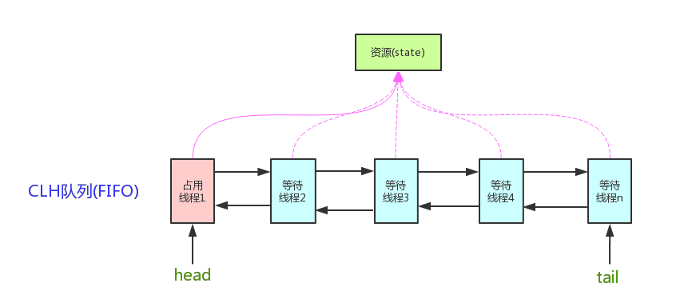

# 1. AQS

**AbstractQueueSynchronizer** 抽象的队列式的同步器，AQS定义了一套多线程访问共享资源的同步器框架，许多同步类实现都依赖于它，如常用的ReentrantLock/Semaphore/CountDownLatch...

## 1.1 整体架构



它维护了一个**volatile int state**（代表共享资源）和一个**FIFO线程等待队列**（多线程争用资源被阻塞时会进入此队列。AQS定义两种资源共享方式：**Exclusive**（独占，只有一个线程能执行，如ReentrantLock）和**Share（共享**，多个线程可同时执行，如Semaphore/CountDownLatch）。

## 1.2 源码解析

### 1.2.1 内部类

```java
static final class Node {
    static final Node SHARED = new Node(); // 共享
    static final Node EXCLUSIVE = null;    // 独占
    
    static final int CANCELLED =  1;        //表示当前结点已取消调度。当timeout或被中断（响应中断的情况下），会触发变更为此状态，进入该状态后的结点将不会再变化。
    static final int SIGNAL    = -1;		//表示后继结点在等待当前结点唤醒。后继结点入队时，会将前继结点的状态更新为SIGNAL
    static final int CONDITION = -2;		//表示结点等待在Condition上，当其他线程调用了Condition的signal()方法后，CONDITION状态的结点将从等待队列转移到同步队列中，等待获取同步锁。

    static final int PROPAGATE = -3;		//共享模式下，前继结点不仅会唤醒其后继结点，同时也可能会唤醒后继的后继结点。

    volatile int waitStatus;				// 节点状态
    
    volatile Node prev;						// 前去后继
    volatile Node next;
    
    volatile Thread thread;					// 线程信息
    Node nextWaiter;
}
```

### 1.2.2 成员变量

```java 
private transient volatile Node head;  // 链表头
private transient volatile Node tail;  // 尾
private volatile int state;            // 线程同步状态，0：未加锁，1：加锁
```

### 1.2.3 state状态方法

```java
protected final int getState() {return state;}

protected final void setState(int newState) {state = newState;}

// 使用CAS的方式改变同步状态
protected final boolean compareAndSetState(int expect, int update) {
	return unsafe.compareAndSwapInt(this, stateOffset, expect, update);
}
```

### 1.2.4 Node节点入队

```java 
private Node enq(final Node node) {
        for (;;) {
            Node t = tail;
            if (t == null) { // Must initialize
                if (compareAndSetHead(new Node()))
                    tail = head;
            } else {
                node.prev = t;
                if (compareAndSetTail(t, node)) {
                    t.next = node;
                    return t;
                }
            }
        }
    }

private Node addWaiter(Node mode) {
    Node node = new Node(Thread.currentThread(), mode); // 新建节点
    // 快速入队方式
    Node pred = tail;
    if (pred != null) {
        node.prev = pred;
        if (compareAndSetTail(pred, node)) {
            pred.next = node;
            return node;
        }
    }
    // 失败则 使用enq入队
    enq(node);
    return node;
}
```

### 1.2.5 acquire(独占)

此方法是独占模式下线程获取共享资源的顶层入口。如果获取到资源，线程直接返回，否则进入等待队列，直到获取到资源为止，且整个过程忽略中断的影响。这也正是lock()的语义，当然不仅仅只限于lock()。获取到资源后，线程就可以去执行其临界区代码了

```java 
public final void acquire(int arg) {
        if (!tryAcquire(arg) &&
            acquireQueued(addWaiter(Node.EXCLUSIVE), arg)
           )
            selfInterrupt();
}
```

函数流程如下：

1. tryAcquire()尝试直接去获取资源，如果成功则直接返回（这里体现了非公平锁，每个线程获取锁时会尝试直接抢占加塞一次，而CLH队列中可能还有别的线程在等待）；
2. addWaiter()将该线程加入等待队列的尾部，并标记为独占模式；
3. acquireQueued()使线程阻塞在等待队列中获取资源，一直获取到资源后才返回。如果在整个等待过程中被中断过，则返回true，否则返回false。
4. 如果线程在等待过程中被中断过，它是不响应的。只是获取资源后才再进行自我中断selfInterrupt()，将中断补上。

#### 1.2.5.1 tryAcquire

此方法尝试去获取独占资源。如果获取成功，则直接返回true，否则直接返回false。这也正是tryLock()的语义，还是那句话，当然不仅仅只限于tryLock()。

```java 
 protected boolean tryAcquire(int arg) {
        throw new UnsupportedOperationException();
}
```

**AQS只是一个框架** AQS这里只定义了一个接口，具体资源的获取交由自定义同步器去实现了（通过state的get/set/CAS）

#### 1.2.5.2 acquireQueued

**在等待队列中排队拿号（中间没其它事干可以休息），直到拿到号后再返回**

```java 
final boolean acquireQueued(final Node node, int arg) {
    boolean failed = true; // 标记是否已经获取资源
    try {
        boolean interrupted = false; 
        for (;;) {
            final Node p = node.predecessor(); // 拿到Node 前驱
            // 如果前驱是head，即该结点已成老二，那么便有资格去尝试获取资源
            if (p == head && tryAcquire(arg)) { 
                setHead(node); //拿到资源后，将head指向该结点。所以head所指的标杆结点，就是当前获取到资源的那个结点或null。
                p.next = null; // help GC
                failed = false;
                return interrupted;
            }
            // 如果自己可以休息了，就通过park()进入waiting状态，直到被unpark()。如果不可中断的情况下被中断了，那么会从park()中醒过来，发现拿不到资源，从而继续进入park()等待
            if (shouldParkAfterFailedAcquire(p, node) &&
                parkAndCheckInterrupt())
                // 如果等待过程中被中断过，哪怕只有那么一次，就将interrupted标记为true
                interrupted = true;
        }
    } finally {
        if (failed)
            // 如果等待过程中没有成功获取资源（如timeout，或者可中断的情况下被中断了），那么取消结点在队列中的等待。
            cancelAcquire(node);
    }
}
```

#### 1.2.5.2 shouldParkAfterFailedAcquire

此方法主要用于检查状态，看看是否进入waiting状态

```java
private static boolean shouldParkAfterFailedAcquire(Node pred, Node node) {
    int ws = pred.waitStatus;
    if (ws == Node.SIGNAL)
        // 前驱被唤醒，直接返回
        return true;
    if (ws > 0) { // 表示前驱节点被取消
        do {
            // 如果前驱放弃了，那就一直往前找，直到找到最近一个正常等待的状态，并排在它的后边
            node.prev = pred = pred.prev; 
        } while (pred.waitStatus > 0);
        pred.next = node;
    } else {
          //如果前驱正常，那就把前驱的状态设置成SIGNAL，告诉它拿完号后通知自己一下。
        compareAndSetWaitStatus(pred, ws, Node.SIGNAL);
    }
    return false;
}
```

#### 1.2.5.3 parkAndCheckInterrupt

如果线程找好安全休息点后，那就可以安心去休息了。此方法就是让线程去休息，真正进入等待状态

```java 
private final boolean parkAndCheckInterrupt() {
    LockSupport.park(this);
    return Thread.interrupted();
}
```

#### 总结


### 1.2.6 Release（独占）

此方法是独占模式下线程释放共享资源的顶层入口。它会释放指定量的资源，如果彻底释放了（即state=0）,它会唤醒等待队列里的其他线程来获取资源。这也正是unlock()的语义，当然不仅仅只限于unlock()。下面是release()的源码：

```java
public final boolean release(int arg) {
    if (tryRelease(arg)) {
        Node h = head;
        if (h != null && h.waitStatus != 0)
            unparkSuccessor(h); // 唤醒等待队列里的下一个线程
        return true; 
    }
    return false;
}
```

#### 1.2.6.1 tryRelease

此方法尝试去释放指定量的资源。下面是tryRelease()的源码：

```java
protected boolean tryRelease(int arg) {
    throw new UnsupportedOperationException();
}
```

线程来释放资源，那么它肯定已经拿到独占资源了，直接减掉相应量的资源即可(state -= arg)，也不需要考虑线程安全的问题。但要注意它的返回值，上面已经提到了，**release()是根据tryRelease()的返回值来判断该线程是否已经完成释放掉资源了！**所以自义定同步器在实现时，如果已经彻底释放资源(state=0)，要返回true，否则返回false。

#### 1.2.6.2 unparkSuccessor

此方法用于唤醒等待队列中下一个线程

```java
private void unparkSuccessor(Node node) { 
    int ws = node.waitStatus;
    if (ws < 0)
        // 置零当前线程所在的结点状态，允许失败。
        compareAndSetWaitStatus(node, ws, 0); 

    Node s = node.next;
    if (s == null || s.waitStatus > 0) {
        s = null;
        // 从后往前找节点
        for (Node t = tail; t != null && t != node; t = t.prev)
            if (t.waitStatus <= 0)
                s = t;
    }
    if (s != null)
        LockSupport.unpark(s.thread);
}
```

**用unpark()唤醒等待队列中最前边的那个未放弃线程**，这里我们也用s来表示吧。此时，再和acquireQueued()联系起来，s被唤醒后，进入if (p == head && tryAcquire(arg))的判断（即使p!=head也没关系，它会再进入shouldParkAfterFailedAcquire()寻找一个安全点。这里既然s已经是等待队列中最前边的那个未放弃线程了，那么通过shouldParkAfterFailedAcquire()的调整，s也必然会跑到head的next结点，下一次自旋p==head就成立啦），然后s把自己设置成head标杆结点，表示自己已经获取到资源了，acquire()也返回了

### 1.2.7 acquireShared（共享

此方法是共享模式下线程获取共享资源的顶层入口。它会获取指定量的资源，获取成功则直接返回，获取失败则进入等待队列，直到获取到资源为止，整个过程忽略中断

```java
public final void acquireShared(int arg) {
    if (tryAcquireShared(arg) < 0)
        doAcquireShared(arg);
}
```

1. tryAcquireShared()尝试获取资源，成功则直接返回；
2. 失败则通过doAcquireShared()进入等待队列，直到获取到资源为止才返

#### 1.2.7.1 tryAcquireShared

```java
protected int tryAcquireShared(int arg) {
    throw new UnsupportedOperationException();
}
```

#### 1.2.7.2 doAcquireShared

此方法用于将当前线程加入等待队列尾部休息，直到其他线程释放资源唤醒自己，自己成功拿到相应量的资源后才返回

```java
private void doAcquireShared(int arg) {
    final Node node = addWaiter(Node.SHARED); // 将Node加入等待队列尾部
    boolean failed = true;                    // 标志获取资源是否成功
    try {
        boolean interrupted = false;
        for (;;) {
            final Node p = node.predecessor();
             // 如果到head的下一个，因为head是拿到资源的线程，此时node被唤醒，很可能是head用完资源来唤醒自己的
            if (p == head) {
                int r = tryAcquireShared(arg);
                if (r >= 0) {
                    setHeadAndPropagate(node, r); //将head指向自己，还有剩余资源可以再唤醒之后的线程
                    p.next = null; // help GC
                    if (interrupted)
                        selfInterrupt();//如果等待过程中被打断过，此时将中断补上
                    failed = false;
                    return;
                }
            }
            if (shouldParkAfterFailedAcquire(p, node) &&
                parkAndCheckInterrupt())
                interrupted = true;
        }
    } finally {
        if (failed)
            cancelAcquire(node);
    }
}
```

跟独占模式比，还有一点需要注意的是，这里只有线程是head.next时（“”），才会去尝试获取资源，有剩余的话还会唤醒之后的队友。那么问题就来了，假如老大用完后释放了5个资源，而老二需要6个，老三需要1个，老四需要2个。老大先唤醒老二，老二一看资源不够，他是把资源让给老三呢，还是不让？答案是否定的！老二会继续park()等待其他线程释放资源，也更不会去唤醒老三和老四了。独占模式，同一时刻只有一个线程去执行，这样做未尝不可；但共享模式下，多个线程是可以同时执行的，现在因为老二的资源需求量大，而把后面量小的老三和老四也都卡住了。当然，这并不是问题，只是AQS保证严格按照入队顺序唤醒罢了（保证公平，但降低了并发）。

#### 1.2.7.3 setHeadAndPropagate

```java
 1 private void setHeadAndPropagate(Node node, int propagate) {
 2     Node h = head; 
 3     setHead(node);//head指向自己
 4      //如果还有剩余量，继续唤醒下一个邻居线程
 5     if (propagate > 0 || h == null || h.waitStatus < 0) {
 6         Node s = node.next;
 7         if (s == null || s.isShared())
 8             doReleaseShared();
 9     }
10 }
```

　　此方法在setHead()的基础上多了一步，就是自己苏醒的同时，如果条件符合（比如还有剩余资源），还会去唤醒后继结点，毕竟是共享模式！

#### 总结

流程：

1. 1. tryAcquireShared()尝试获取资源，成功则直接返回；
   2. 失败则通过doAcquireShared()进入等待队列park()，直到被unpark()/interrupt()并成功获取到资源才返回。整个等待过程也是忽略中断的。

　　其实跟acquire()的流程大同小异，只不过多了个自己拿到资源后，还会去唤醒后继队友的操作

### 1.2.8 releaseShared

```java
public final boolean releaseShared(int arg) {
    // 1. 释放资源
    if (tryReleaseShared(arg)) {
        doReleaseShared(); // 2. 唤醒后续节点
        return true;
    }
    return false;
}
```

#### 1.2.8.1 doReleaseShared

此方法主要用于唤醒后继

```java
private void doReleaseShared() {
    for (;;) {
        Node h = head;
        if (h != null && h != tail) {
            int ws = h.waitStatus;
            if (ws == Node.SIGNAL) {
                if (!compareAndSetWaitStatus(h, Node.SIGNAL, 0))
                    continue;            // loop to recheck cases
                unparkSuccessor(h); // 唤醒后继
            }
            else if (ws == 0 &&
                     !compareAndSetWaitStatus(h, 0, Node.PROPAGATE))
                continue;                // loop on failed CAS
        }
        if (h == head)                   // loop if head changed
            break;
    }
}
```


## 2. RentrantLock


#### 2.1 Sync实现自定义AQS

```java
abstract static class Sync extends AbstractQueuedSynchronizer {
 
    abstract void lock();

    final boolean nonfairTryAcquire(int acquires) {
        final Thread current = Thread.currentThread();
        int c = getState();
        if (c == 0) {
            if (compareAndSetState(0, acquires)) {
                setExclusiveOwnerThread(current);
                return true;
            }
        }
        else if (current == getExclusiveOwnerThread()) {
            int nextc = c + acquires;
            if (nextc < 0) // overflow
                throw new Error("Maximum lock count exceeded");
            setState(nextc);
            return true;
        }
        return false;
    }

    protected final boolean tryRelease(int releases) {
        int c = getState() - releases;
        if (Thread.currentThread() != getExclusiveOwnerThread())
            throw new IllegalMonitorStateException();
        boolean free = false;
        if (c == 0) {
            free = true;
            setExclusiveOwnerThread(null);
        }
        setState(c);
        return free;
    }

    protected final boolean isHeldExclusively() {
        // While we must in general read state before owner,
        // we don't need to do so to check if current thread is owner
        return getExclusiveOwnerThread() == Thread.currentThread();
    }

    final boolean isLocked() {
        return getState() != 0;
    }
}
```

#### 2.2 非公平锁

```java
static final class NonfairSync extends Sync {

    final void lock() {
        if (compareAndSetState(0, 1))
            setExclusiveOwnerThread(Thread.currentThread());
        else
            acquire(1);
    }

    protected final boolean tryAcquire(int acquires) {
        return nonfairTryAcquire(acquires);
    }
}
```

#### 2.3 公平锁

```java
static final class FairSync extends Sync {
    final void lock() {
        acquire(1);
    }

    protected final boolean tryAcquire(int acquires) {
        final Thread current = Thread.currentThread();
        int c = getState();
        if (c == 0) {
            if (!hasQueuedPredecessors() &&
                compareAndSetState(0, acquires)) {
                setExclusiveOwnerThread(current);
                return true;
            }
        }
        else if (current == getExclusiveOwnerThread()) {
            int nextc = c + acquires;
            if (nextc < 0)
                throw new Error("Maximum lock count exceeded");
            setState(nextc);
            return true;
        }
        return false;
    }
}
```

#### 2.4 成员变量

```java
private final Sync sync;
```

#### 2.5 成员方法

```
public ReentrantLock(boolean fair) {
    sync = fair ? new FairSync() : new NonfairSync();
}
    
public void lock() {
    sync.lock();
}

public boolean tryLock() {
	return sync.nonfairTryAcquire(1);
}

public void unlock() {
    sync.release(1);
}
```

