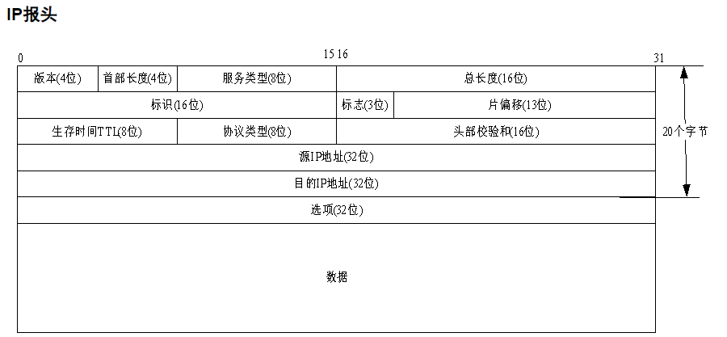

## 1. 网络分层模型

### 1.1 OSI七层模型 & TCP/IP四层模型

.png)

### 1.2 各层含义

1. **物理层**：主要定义物理设备标准，如网线的接口类型、光纤的接口类型、各种传输介质的传输速率等。它的主要作用是传输比特流（就是由1、0转化为电流强弱来进行传输，到达目的地后再转化为1、0，也就是我们常说的数模转换与模数转换）。这一层的数据叫做比特。
2. **数据链路层**：定义了如何让格式化数据以帧为单位进行传输，以及如何让控制对物理介质的访问。这一层通常还提供错误检测和纠正，以确保数据的可靠传输。
3. **网络层**：在位于不同网络中的两个主机系统之间提供连接和路径选择。
4. **传输层**：定义了一些传输数据的协议和端口号（端口80，22等），如：TCP（传输控制协议，传输效率低，可靠性强，用于传输可靠性要求高，数据量大的数据），UDP（用户数据报协议，与TCP特性恰恰相反，用于传输可靠性要求不高，数据量小的数据，如QQ聊天数据就是通过这种方式传输的）。 主要是将从下层接收的数据进行分段和传输，到达目的地址后再进行重组。常常把这一层数据叫做段。
5. **会话层**：通过传输层(端口号：传输端口与接收端口)建立数据传输的通路。主要在你的系统之间发起会话或者接受会话请求（设备之间需要互相认识可以是IP也可以是MAC或者是主机名）。
6. **表示层**：可确保一个系统的应用层所发送的信息可以被另一个系统的应用层读取，表示层会通过使用一种通格式来实现多种数据格式之间的转换。
7. **应用层**： 是最靠近用户的OSI层。这一层为用户的应用程序（例如电子邮件、文件传输和终端仿真）提供网络服务。

### 1.3 传输协议

1. TCP传输控制协议（Transmission Control Protocol）是一种面向连接的、可靠的、基于字节流的[传输层](http://baike.baidu.com/view/239605.htm)通信协议。
2. UDP用户数据报协议（User Datagram Protocol）是[OSI](http://baike.baidu.com/view/113948.htm)参考模型中一种无连接的[传输层](http://baike.baidu.com/view/239605.htm)协议，提供面向事务的简单不可靠信息传送服务
3. HTTP[超文本传输协议](http://baike.baidu.com/view/468465.htm)（Hyper Text Transfer Protocol）是[互联网](http://baike.baidu.com/view/6825.htm)上应用最为广泛的一种[网络协议](http://baike.baidu.com/view/16603.htm)。
4. IP协议是[因特网](http://baike.baidu.com/view/1706.htm)互联协议（Internet Protocol）
5. ICMP协议是Internet控制[报文](http://baike.baidu.com/view/175122.htm)协议（Internet Control Message Protocol）它是[TCP/IP协议族](http://baike.baidu.com/view/2221037.htm)的一个子协议，用于在IP[主机](http://baike.baidu.com/view/23880.htm)、[路由](http://baike.baidu.com/view/18655.htm)器之间传递控制消息。
6. IGMP协议是 Internet 组管理协议（Internet Group Management Protocol），是因特网协议家族中的一个组播协议。该协议运行在主机和组播路由器之间。
7. [ARP](http://baike.baidu.com/view/32698.htm)协议是正向[地址解析协议](http://baike.baidu.com/view/149421.htm)（Address Resolution Protocol），通过已知的IP，寻找对应主机的[MAC地址](http://baike.baidu.com/view/69334.htm)。
8. [RARP](http://baike.baidu.com/view/32772.htm)是反向地址转换协议，通过MAC地址确定IP地址。

## 2. 协议格式

### 2.1 MAC格式

* 源地址和目的地址：是指网卡的硬件地址（也叫MAC地址），长度是48位，是在网卡出厂时固化的。可在shell中使用ifconfig命令查看，“HWaddr 00:15:F2:14:9E:3F”部分就是硬件地址。
* 类型：协议字段有三种值，分别对应IP、ARP、RARP。帧尾是CRC校验码。
* 以太网帧中的数据长度规定最小46字节，最大1500字节，ARP和RARP数据包的长度不够46字节，要在后面补填充位。**最大值1500称为以太网的最大传输单元（MTU）**，不同的网络类型有不同的MTU，如果一个数据包从以太网路由到拨号链路上，数据包长度大于拨号链路的MTU，则需要对数据包进行分（fragmentation）。ifconfig命令输出中也有“MTU:1500”。注意，MTU这个概念指数据帧中有效载荷的最大长度，不包括帧头长度。

### 2.2 ARP数据报格式

在网络通讯时，**源主机**的应用程序知道**目的主机的IP地址和端口号**，却不知道**目的主机的硬件地址**，而数据包首先是被网卡接收到再去处理上层协议的，如果接收到的数据包的硬件地址与本机不符，则直接丢弃。

因此在通讯前必须获得目的主机的硬件地址。ARP协议就起到这个作用。

源主机发出ARP请求，询问“IP地址是192.168.0.1的主机的硬件地址是多少”，并将这个请求广播到本地网段（以太网帧首部的硬件地址填FF:FF:FF:FF:FF:FF表示广播），目的主机接收到广播的ARP请求，发现其中的IP地址与本机相符，则发送一个ARP应答数据包给源主机，将自己的硬件地址填写在应答包中。

* Dest MAC, Src MAC：目的地Mac地址，及自己的Mac地址
* 帧类型：0x0806 IP地址
* 硬件类型：1（以太网）
* 协议类型：0x0800（IP地址）
* 硬件地址长度：6
* 协议地址长度：4（IPV4)
* OP：1（ARP请求），2（ARP应答），3（RARP请求），4（RARP应答）

### 2.3 TCP 数据包格式

头部**20**字节

* 源端口号：发送方端口号
* 目的端口号：接收方端口号
* 序列号：本报文段的数据的第一个字节的序号
* 确认序号：期望收到对方的下一个报文段的第一个数据字节的序号
* 首部长度：也叫数据偏移，TCP报文段的数据的起始处距离TCP报文段的起始处有多远，即首部长度
* 保留：占6位
* 紧急URG：当为1，表明紧急指针有效，表明数据应该尽快发送
* 确认ACK：当ACK=1，才有效，TCP规定，在建立连接后，所有的报文段都必须把ACK置位1
* 推送PSH：当两个应用进程进行交互式的通信时，有时在一端的应用进程希望在键入一个命令后立就可以收到对方的响应。咋这种情况下，TCP就可以使用 PUSH操作，把PSH置位1，并立即创建一个报文段发送出去，接收方收到PSH=1的报文段，就可以交付给接收应用进程，而不再等待整个缓存都填满后在向上交付
* 复位RST：用于复位响应的TCP连接
* 同步SYN：尽在三次握手建立TCP连接时有效。当SYN=1且ACK=0时，标识这是个连接请求报文段，若对方同意建立连接，则在相应报文段中使用SYN=1和ACK=1，因此，SYN=1标识这是一个连接请求或者连接接受请求报文
* 终止FIN：释放TCP连接，FIN=1生效
* 窗口：发送报文段的一方的接受窗口（不是自己的发送窗口
* 校验和：校验和字段 检验的范围包括首部和数据部分，在计算校验和时需要加上12字节的为头部
* 紧急指针URG：当URG=1生效，指出本报文段中的紧急数据的字节数，窗口为0也可以发送紧急数据
* 选型：可变长度，最多40字节

### 2.4 UDP数据报格式

### 2.5 IP报头格式

* 版本：IP协议的版本。通信双方使用过的IP协议的版本必须一致，目前最广泛使用的IP协议版本号为4（即IPv4 )
* 首部长度：单位是32位（4字节）
* 服务类型：一般不适用，取值为0
* 总长度：指首部加上数据的总长度，单位为字节
* 标识（identification）：IP软件在存储器中维持一个计数器，每产生一个数据报，计数器就加1，并将此值赋给标识字段
* 标志（flag）：目前只有两位有意义。
  * 标志字段中的最低位记为MF。MF=1即表示后面“还有分片”的数据报。MF=0表示这已是若干数据报片中的最后一个。
  * 标志字段中间的一位记为DF，意思是“不能分片”，只有当DF=0时才允许分片
* 片偏移：指出较长的分组在分片后，某片在源分组中的相对位置，也就是说，相对于用户数据段的起点，该片从何处开始。片偏移以8字节为偏移单位。
* 生存时间：TTL，表明是数据报在网络中的寿命，即为“跳数限制”，由发出数据报的源点设置这个字段。路由器在转发数据之前就把TTL值减一，当TTL值减为零时，就丢弃这个数据报。一般取64或者128
* 协议：指出此数据报携带的数据时使用何种协议，以便使目的主机的IP层知道应将数据部分上交给哪个处理过程，常用的ICMP(1)、IGMP(2)、TCP(6)、UDP(17)、IPv6（41）
* 首部校验和：只校验数据报的首部，不包括数据部分。
* 源地址：发送方IP地址
* 目的地址：接收方IP地址

## 3. 数据包封包

传输层及其以下的机制由内核提供，应用层由用户进程提供，应用程序对通讯数据的含义进行解释，而传输层及其以下处理通讯的细节，将数据从一台计算机通过一定的路径发送到另一台计算机。应用层数据通过协议栈发到网络上时，每层协议都要加上一个数据首部（header），称为封装。

不同的协议层对数据包有不同的称谓，在传输层叫做段（segment），在网络层叫做数据报（datagram），在链路层叫做帧（frame）。数据封装成帧后发到传输介质上，到达目的主机后每层协议再剥掉相应的首部，最后将应用层数据交给应用程序处理。

## 4. TCP

### 4.1 TCP三次握手、四次挥手

TCP建立连接，**三次握手**过程：

1. 客户端发出段1，SYN位表示连接请求。序号是1000，这个序号在网络通讯中用作临时的地址，每发一个数据字节，这个序号要加1，这样在接收端可以根据序号排出数据包的正确顺序，也可以发现丢包的情况，另外，规定SYN位和FIN位也要占一个序号，这次虽然没发数据，但是由于发了SYN位，因此下次再发送应该用序号1001。mss表示最大段尺寸，如果一个段太大，封装成帧后超过了链路层的最大帧长度，就必须在IP层分片，为了避免这种情况，客户端声明自己的最大段尺寸，建议服务器端发来的段不要超过这个长度。
2. 服务器发出段2，也带有SYN位，同时置ACK位表示确认，确认序号是1001，表示“我接收到序号1000及其以前所有的段，请你下次发送序号为1001的段”，也就是应答了客户端的连接请求，同时也给客户端发出一个连接请求，同时声明最大尺寸为1024。
3. 客户端发出段3，对服务器的连接请求进行应答，确认序号是8001。在这个过程中，客户端和服务器分别给对方发了连接请求，也应答了对方的连接请求，其中服务器的请求和应答在一个段中发出，因此一共有三个段用于建立连接，称为“三方握手（three-way-handshake）”。在建立连接的同时，双方协商了一些信息，例如双方发送序号的初始值、最大段尺寸等。

关闭连接（**四次握手**）的过程：

由于TCP连接是全双工的，因此每个方向都必须单独进行关闭。这原则是当一方完成它的数据发送任务后就能发送一个FIN来终止这个方向的连接。收到一个 FIN只意味着这一方向上没有数据流动，一个TCP连接在收到一个FIN后仍能发送数据。首先进行关闭的一方将执行主动关闭，而另一方执行被动关闭。

1. 客户端发出段7，FIN位表示关闭连接的请求。

2. 服务器发出段8，应答客户端的关闭连接请求。

3. 服务器发出段9，其中也包含FIN位，向客户端发送关闭连接请求。

4. 客户端发出段10，应答服务器的关闭连接请求。

建立连接的过程是三方握手，而关闭连接通常需要4个段，服务器的应答和关闭连接请求通常不合并在一个段中，因为有连接半关闭的情况，这种情况下客户端关闭连接之后就不能再发送数据给服务器了，但是服务器还可以发送数据给客户端，直到服务器也关闭连接为止。

### 4.2. TCP流量控制

如果发送端发送的速度较快，接收端接收到数据后处理的速度较慢，而接收缓冲区的大小是固定的，就会丢失数据。TCP协议通过“滑动窗口（Sliding Window）”机制解决这一问题。

在TCP报文头中，存在**窗口尺寸**标志位，通过该位可以**通知对方自己的缓冲区**大小。

**流程说明：**

1. 发送端发起连接，声明最大段尺寸是1460，初始序号是0，窗口大小是4K，表示“我的接收缓冲区还有4K字节空闲，你发的数据不要超过4K”。接收端应答连接请求，声明最大段尺寸是1024，初始序号是8000，窗口大小是6K。发送端应答，三方握手结束。

2. 发送端发出段4-9，每个段带1K的数据，发送端根据窗口大小知道接收端的缓冲区满了，因此停止发送数据。

3. 接收端的应用程序提走2K数据，接收缓冲区又有了2K空闲，接收端发出段10，在应答已收到6K数据的同时声明窗口大小为2K。

4. 接收端的应用程序又提走2K数据，接收缓冲区有4K空闲，接收端发出段11，重新声明窗口大小为4K。

5. 发送端发出段12-13，每个段带2K数据，段13同时还包含FIN位。

6. 接收端应答接收到的2K数据（6145-8192），再加上FIN位占一个序号8193，因此应答序号是8194，连接处于半关闭状态，接收端同时声明窗口大小为2K。

7. 接收端的应用程序提走2K数据，接收端重新声明窗口大小为4K。

8. 接收端的应用程序提走剩下的2K数据，接收缓冲区全空，接收端重新声明窗口大小为6K。

接收端的应用程序在提走全部数据后，决定关闭连接，发出段17包含FIN位，发送端应答，连接完全关闭。

**右部图示：**

上图在接收端用小方块表示1K数据，实心的小方块表示已接收到的数据，虚线框表示接收缓冲区，因此套在虚线框中的空心小方块表示窗口大小，从图中可以看出，随着应用程序提走数据，虚线框是向右滑动的，因此称为滑动窗口。

从这个例子还可以看出，发送端是一K一K地发送数据，而接收端的应用程序可以两K两K地提走数据，当然也有可能一次提走3K或6K数据，或者一次只提走几个字节的数据。也就是说，应用程序所看到的数据是一个整体，或说是一个流（stream），在底层通讯中这些数据可能被拆成很多数据包来发送，但是一个数据包有多少字节对应用程序是不可见的，因此TCP协议是面向流的协议。而UDP是面向消息的协议，每个UDP段都是一条消息，应用程序必须以消息为单位提取数据，不能一次提取任意字节的数据，这一点和TCP是很不同的。

### 4.3 TCP状态转换

该图说明：TCP三次握手、数据传输、四次挥手过程。

### 4.4 半关闭

当TCP链接中A发送FIN请求关闭，B端回应ACK后（A端进入FIN_WAIT_2状态），B没有立即发送FIN给A时，A方处在半链接状态，此时A可以接收B发送的数据，但是A已不能再向B发送数据。

**tips:**

> TCP建立连接之后，存在读写缓冲区，半关闭指的是关闭写缓冲区

### 4.5 2MSL

**2MSL** (Maximum Segment Lifetime) TIME_WAIT状态的存在有两个理由：

1. **让4次握手关闭流程更加可靠**；4次握手的最后一个ACK是是由主动关闭方发送出去的，若这个ACK丢失，被动关闭方会再次发一个FIN过来。若主动关闭方能够保持一个2MSL的TIME_WAIT状态，则有更大的机会让丢失的ACK被再次发送出去。
2. 防止lost duplicate对后续新建正常链接的传输造成破坏。lost duplicate在实际的网络中非常常见，经常是由于路由器产生故障，路径无法收敛，导致一个packet在路由器A，B，C之间做类似死循环的跳转。IP头部有个TTL，限制了一个包在网络中的最大跳数，因此这个包有两种命运，要么最后TTL变为0，在网络中消失；要么TTL在变为0之前路由器路径收敛，它凭借剩余的TTL跳数终于到达目的地。但非常可惜的是TCP通过超时重传机制在早些时候发送了一个跟它一模一样的包，并先于它达到了目的地，因此它的命运也就注定被TCP协议栈抛弃。

### 4.6 端口复用

在server的TCP连接没有完全断开之前不允许重新监听是不合理的。因为，TCP连接没有完全断开指的是connfd（127.0.0.1:6666）没有完全断开，而我们重新监听的是lis-tenfd（0.0.0.0:6666），虽然是占用同一个端口，但IP地址不同，connfd对应的是与某个客户端通讯的一个具体的IP地址，而listenfd对应的是wildcard address。解决这个问题的方法是使用setsockopt()设置socket描述符的选项SO_REUSEADDR为1，表示允许创建端口号相同但IP地址不同的多个socket描述符。

