# OpenSSL

## 1. 摘要（哈希）

> 原文通过 **哈希算法**生成固定长度哈希值

### 1.1 常见算法

* MD4、MD5：已经被破解（通过枚举），长度**16字节**
* SHA-1：
  * 散列值长度: **20字节**
  * 已经被破解
* SHA-2
  - sha224
    - 散列值长度: 224bit / 8 = 28byte
  - sha256
    - 散列值长度: 256bit / 8 = 32byte
  - sha384
    - 散列值长度: 384bit / 8 = 48byte
  - sha512
    - 散列值长度: 512bit / 8 = 64byte
* SHA3-224/SHA3-256/SHA3-384/SHA3-512

### 1.2 特点

- 不管原始数据有多长, 通过哈希算法进行计算, 得到的结果的长度是固定的
  - 是一个二进制的字符串
- 只要是原始数据不一样, 得到的结果就不一样
  - 原始数据差一丢丢, 得到的结果也是完全不同的
- 有很强的抗碰撞性
  - 碰撞: 原始数据不同, 但是通过同样的哈希算法进行计算能得到相同的结果
  - 推导的结论:
   - 数据不同得到的结果就不同
- 应用场景:
  - 数据校验
  - 登录验证
  - 秒传（服务器上已经存在数据）
- 不可逆
  - 得到的结果不能推导出原始数据

### 1.3 API

#### 1.3.1 MD5、MD4、MD2

```c
#include <openssl/md2.h>


// 原始数据直接生成哈希值
unsigned char *MD2(const unsigned char *d, unsigned long n, unsigned char *md);

int MD2_Init(MD2_CTX *c); // 初始化c结构体
// 添加数据、可以循环添加
int MD2_Update(MD2_CTX *c, const unsigned char *data, unsigned long len);
// 计算哈希值、将结果存入md中
int MD2_Final(unsigned char *md, MD2_CTX *c);


#include <openssl/md4.h>

unsigned char *MD4(const unsigned char *d, unsigned long n, unsigned char *md);

int MD4_Init(MD4_CTX *c);
int MD4_Update(MD4_CTX *c, const void *data, unsigned long len);
int MD4_Final(unsigned char *md, MD4_CTX *c);


#include <openssl/md5.h>

unsigned char *MD5(const unsigned char *d, unsigned long n, unsigned char *md);

int MD5_Init(MD5_CTX *c);
int MD5_Update(MD5_CTX *c, const void *data, unsigned long len);
int MD5_Final(unsigned char *md, MD5_CTX *c);
```

MD5 demo

```c
#include <stdio.h>
#include <stdlib.h>
#include <string.h>
#include <openssl/md5.h>

int main(int argc, char *argv[])
{

	MD5_CTX c;
	MD5_Init(&c);

	const char *str = "hello";

	MD5_Update(&c, str, strlen(str));

	unsigned char md[16] = {0};
	MD5_Final(md, &c);

	char res[33] = {0};
	int i;

	for (i = 0; i < 16; i++)
	{
		sprintf(&res[i *2], "%02x", md[i]);
	}

	printf("%s", res);


	return 0;
}
```

#### 1.3.2 SHA

```c
#include <openssl/sha.h>
# define SHA_DIGEST_LENGTH 20
# define SHA224_DIGEST_LENGTH    28
# define SHA256_DIGEST_LENGTH    32
# define SHA384_DIGEST_LENGTH    48
# define SHA512_DIGEST_LENGTH    64


int SHA1_Init(SHA_CTX *c);
int SHA1_Update(SHA_CTX *c, const void *data, size_t len);
int SHA1_Final(unsigned char *md, SHA_CTX *c);
unsigned char *SHA1(const unsigned char *d, size_t n,unsigned char *md);

int SHA224_Init(SHA256_CTX *c);
int SHA224_Update(SHA256_CTX *c, const void *data, size_t len);
int SHA224_Final(unsigned char *md, SHA256_CTX *c);
unsigned char *SHA224(const unsigned char *d, size_t n,unsigned char *md);

int SHA256_Init(SHA256_CTX *c);
int SHA256_Update(SHA256_CTX *c, const void *data, size_t len);
int SHA256_Final(unsigned char *md, SHA256_CTX *c);
unsigned char *SHA256(const unsigned char *d, size_t n,
                      unsigned char *md);

int SHA384_Init(SHA512_CTX *c);
int SHA384_Update(SHA512_CTX *c, const void *data, size_t len);
int SHA384_Final(unsigned char *md, SHA512_CTX *c);
unsigned char *SHA384(const unsigned char *d, size_t n,
                      unsigned char *md);

int SHA512_Init(SHA512_CTX *c);
int SHA512_Update(SHA512_CTX *c, const void *data, size_t len);
int SHA512_Final(unsigned char *md, SHA512_CTX *c);
unsigned char *SHA512(const unsigned char *d, size_t n,
                      unsigned char *md);
```

## 2. 非对称加密

> 加解密使用密钥不是同一个。
>
> 加密：公钥加密、私钥解密
>
> 数字签名：私钥加密、公钥解密

### 2.1 常用算法：

* RSA
  * RSA 算法密钥长度越长，安全性越好，加密解密所需时间越长。
  * 密钥长度增长一倍，公钥操作所需时间增加约 4 倍，私钥操作所需时间增加约 8 倍，公私钥生成时间约增长 16 倍；
* ECC 椭圆曲线

### 2.2. API

```c
#include <openssl/rsa.h>

RSA *RSA_new(void);
void RSA_free(RSA *r);

// 质数
BIGNUM* BN_new(void);
void BN_free(BIGNUM*);
int BN_set_word(BIGNUM *a, BN_ULONG w);

// 生成密钥对
int RSA_generate_key_ex(RSA *rsa, int bits, BIGNUM *e, BN_GENCB *cb);
int RSA_generate_multi_prime_key(RSA *rsa, int bits, int primes, BIGNUM *e, BN_GENCB *cb);

// 从RSA中读取公私钥
RSA *RSAPublicKey_dup(RSA *rsa);
RSA *RSAPrivateKey_dup(RSA *rsa);

// 加解密
int RSA_public_encrypt(int flen, const unsigned char *from,
                       unsigned char *to, RSA *rsa, int padding);
int RSA_private_encrypt(int flen, const unsigned char *from,
                        unsigned char *to, RSA *rsa, int padding);
int RSA_public_decrypt(int flen, const unsigned char *from,
                       unsigned char *to, RSA *rsa, int padding);
int RSA_private_decrypt(int flen, const unsigned char *from,
                        unsigned char *to, RSA *rsa, int padding);
// 数字签名
int RSA_sign(int type, const unsigned char *m, unsigned int m_length,
             unsigned char *sigret, unsigned int *siglen, RSA *rsa);
int RSA_verify(int type, const unsigned char *m, unsigned int m_length,
               const unsigned char *sigbuf, unsigned int siglen, RSA *rsa);


/ 创建bio对象
// 密钥对写磁盘文件的时候, 需要编码 -> base64
BIO *BIO_new_file(const char *filename, const char *mode);
		
int PEM_write_bio_RSAPublicKey(BIO* bp, const RSA* r);
int PEM_write_bio_RSAPrivateKey(BIO* bp, const RSA* r, const EVP_CIPHER* enc, 
	unsigned char* kstr, int klen, pem_password_cb *cb, void* u);

RSA* PEM_read_bio_RSAPublicKey(BIO* bp, RSA** r, pem_password_cb *cb, void* u);
RSA* PEM_read_bio_RSAPrivateKey(BIO* bp, RSA** r, pem_password_cb *cb, void* u);
	参数: 
		- bp: 通过BIO_new_file();函数得到该对象
		- r: 传递一个RSA* rsa指针的地址, 传出参数-> 公钥/私钥
		- cb: 回调函数, 用不到, 指定为NULL
		- u: 给回调传参, 用不到, 指定为NULL

RSA* PEM_read_RSAPublicKey(FILE* fp, RSA** r, pem_password_cb *cb, void* u);
RSA* PEM_read_RSAPrivateKey(FILE* fp, RSA** r, pem_password_cb *cb, void* u);

int PEM_write_RSAPublicKey(FILE* fp, const RSA* r);
int PEM_write_RSAPrivateKey(FILE* fp, const RSA* r, const EVP_CIPHER* enc, 
	unsigned char* kstr, int klen, pem_password_cb *cb, void* u);	
```


### 2.2 RSA密钥对生成

```c
void rsa_pri_pub_generate()
{
    BIGNUM *big;
    FILE *fp;
    RSA *rsa;

    do
    {
        /* int RSA_generate_key_ex(RSA *rsa, int bits, BIGNUM *e, BN_GENCB *cb); */
        if ((rsa = RSA_new()) == NULL || (big = BN_new()) == NULL)
        {
            printf("RSA_new or BN_new err\n");
            return;
        }
        BN_set_word(big, 12345);
        if (0 == RSA_generate_key_ex(rsa, 1024, big, NULL))
        {
            printf("RSA_generate_key_ex failed...\n");
            return;
        }

        // 写入文件
        fp = fopen("public.pem", "w");
        PEM_write_RSAPublicKey(fp, rsa);
        fclose(fp);

        fp = fopen("private.pem", "w");
        PEM_write_RSAPrivateKey(fp, rsa, NULL, NULL, 0, NULL, NULL);
    } while (0);

    RSA_free(rsa);
    BN_free(big);
    fclose(fp);
}
```

### 2.3 公钥加密、私钥解密

```c
void encrypt_decrypt()
{
    RSA *pubKey;
    RSA *priKey;
    FILE *fr;
    FILE *fw;
    int size;
    char *cipher;
    char *decode;
    const char *str = "hello"; // 原文

    // 从磁盘中读取公私钥文件
    fr = fopen("public.pem", "r");
    if (fr == NULL)
    {
        printf("open public.pem failed\n");
        return;
    }
    pubKey = RSA_new();
    PEM_read_RSAPublicKey(fr, &pubKey, NULL, NULL);
    fflush(fr);
    fclose(fr);

    fw = fopen("private.pem", "r");
    if (fw == NULL)
    {
        printf("open private.pem failed\n");
        return;
    }
    priKey = RSA_new();
    PEM_read_RSAPrivateKey(fw, &priKey, NULL, NULL);
    fflush(fw);
    fclose(fw);
    
    size = RSA_size(pubKey);
    cipher = (char *)malloc(size * sizeof(char));
    if (cipher == NULL)
    {
        printf("malloc failed\n");
        return;
    }
    // 加密
    if (RSA_public_encrypt(strlen(str), str, cipher, pubKey, RSA_PKCS1_PADDING) == 0)
    {
        printf("encrypt failed\n");
        return;
    }

    printf("cipher: %s\n", cipher);

    // 解密
    size = RSA_size(priKey);
    decode = (char *)malloc(size * sizeof(char));
    if (decode == NULL)
    {
        printf("malloc failed\n");
        return;
    }
    if (RSA_private_decrypt(strlen(cipher), cipher, decode, priKey, RSA_PKCS1_PADDING) == 0)
    {
        printf("decrypt failed\n");
        return;
    }
    printf("decode: %s\n", decode);

    RSA_free(pubKey);
    RSA_free(priKey);
    free(cipher);
    free(decode);
}


▒`▒>S▒j /}▒▒▒ԅ▒▒V▒▒▒▒RI\▒L▒▒%▒P+*▒C▒▒k¶X▒d▒▒N'دH7▒▒#<fi▒▒▒▒1▒M▒F▒▒▒▒R{▒;2P9▒xǀ▒▒:aI▒2▒PS]:fe▒U▒X▒
decode: hello
```


## 3. 对称加密

- <font color="red">**DES/3DES**</font>
- DES  -> 已经被破解了, 不安全
  - 秘钥长度 8byte
  - 对数据分段加密, 每组8字节
    - 得到的密文和明文长度是相同的
  - 3DES -> 3重des
    - 安全的, 效率比较低
    - 对数据分段加密, 每组8字节
    - 得到的密文和明文长度是相同的  == 8字节
    - 秘钥长度24字节, 在算法内部会被平均分成3份, == 每份8字节
      - 看成是3个秘钥
      - 每个8字节
    - 加密处理逻辑:
      - 加密: 	-> 秘钥1  * 加密算法
      - 解密     -> 秘钥2   * 解密算法
      - 加密     -> 秘钥3   * 加密算法
    - 三组秘钥都不同, 加密的等级是最高的
- <font color="red">**AES**</font>
  - 最安全, 效率最高的公开的对称加密算法
  - 秘钥长度: 16字节, 24字节, 32字节
    - 秘钥越长加密的数据越安全, 效率越低
  - `分组加密, 每组长度 16 字节`
  - 每组的密文和明文的长度相同  == 16byte
- Blowfish
- RC2/RC4/RC5
- IDEA
- SKIPJACK

### 3.1 密码分组模式

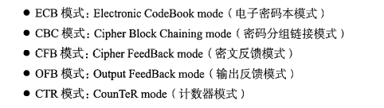

#### 3.1.1 ECB模式

在ECB模式中，将明文分组加密之后的结果将直接成为密文分组。**不安全**

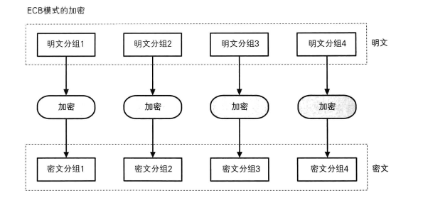

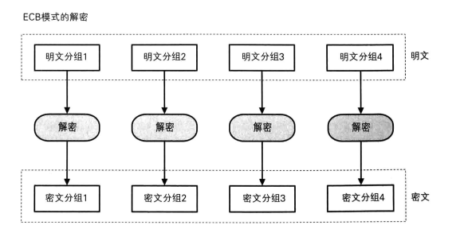

#### 3.1.2 CBC模式

CBC模式是将前一个密文分组与当前明文分组的内容组合起来进行加密，避免了ECB模式的确定。

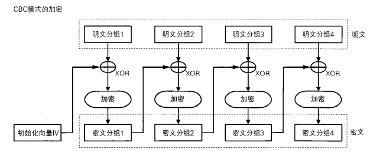

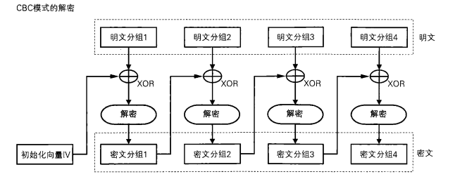

#### 3.1.3 CFB模式

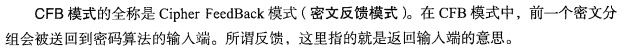

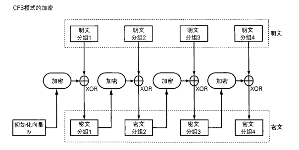

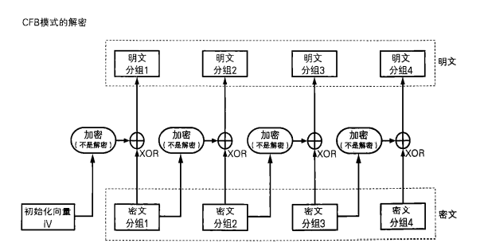

#### 3.1.4 OFB模式

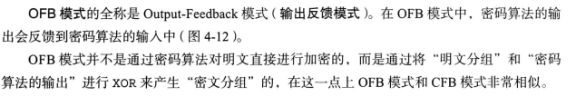

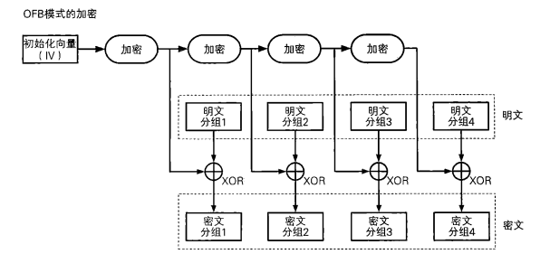

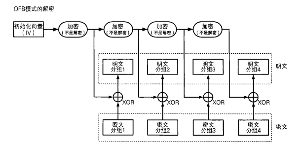

#### 3.1.5 CRT模式

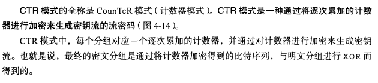

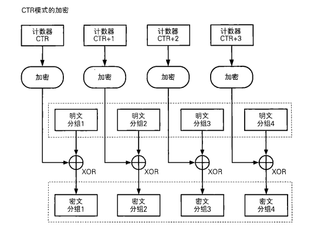

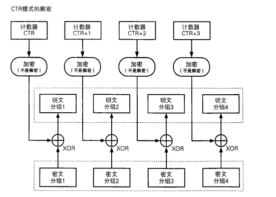

### 3.2 AES

```c

int AES_set_encrypt_key(const unsigned char *userKey, const int bits,
                        AES_KEY *key);
int AES_set_decrypt_key(const unsigned char *userKey, const int bits,
                        AES_KEY *key);

void AES_ecb_encrypt(const unsigned char *in, unsigned char *out,
                     const AES_KEY *key, const int enc);

void AES_cbc_encrypt(const unsigned char *in, unsigned char *out,
                     size_t length, const AES_KEY *key,
                     unsigned char *ivec, const int enc);
void AES_cfb128_encrypt(const unsigned char *in, unsigned char *out,
                        size_t length, const AES_KEY *key,
                        unsigned char *ivec, int *num, const int enc);
void AES_cfb1_encrypt(const unsigned char *in, unsigned char *out,
                      size_t length, const AES_KEY *key,
                      unsigned char *ivec, int *num, const int enc);
void AES_cfb8_encrypt(const unsigned char *in, unsigned char *out,
                      size_t length, const AES_KEY *key,
                      unsigned char *ivec, int *num, const int enc);
void AES_ofb128_encrypt(const unsigned char *in, unsigned char *out,
                        size_t length, const AES_KEY *key,
                        unsigned char *ivec, int *num);
```

```c
void encrypt_decrypt()
{
    const unsigned char *sec = "xll";        // 密钥
    const unsigned char *str = "hello";      // 原文
    unsigned char iv[AES_BLOCK_SIZE];        // 向量
    unsigned char cipher[AES_BLOCK_SIZE];    // 密文
    unsigned char decode[AES_BLOCK_SIZE];    // 解密后原文
    AES_KEY key;
    int len = strlen(str) + 1;
    int lengtn = 0;                         // 生成密文、原文长度

    if (len % 16 != 0)
    {
        lengtn = (len / 16 + 1) * 16;
    }
    else
    {
        lengtn = len;
    }

    // encrypt
    memset(iv, 1, sizeof(iv));
    AES_set_encrypt_key(sec, 128, &key);
    AES_cbc_encrypt(str, cipher, lengtn, &key, iv, AES_ENCRYPT);
    printf("cipher:\n %s\n", cipher);


    // decrypt
    AES_set_decrypt_key(sec, 128, &key);
    memset(iv, 1, sizeof(iv)); 
    AES_cbc_encrypt(cipher, decode, lengtn, &key, iv, AES_DECRYPT);
    decode[lengtn - 1] = '\0';
    printf("decode:\n %s\n", decode);
}
```

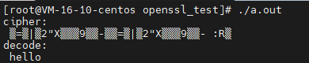

